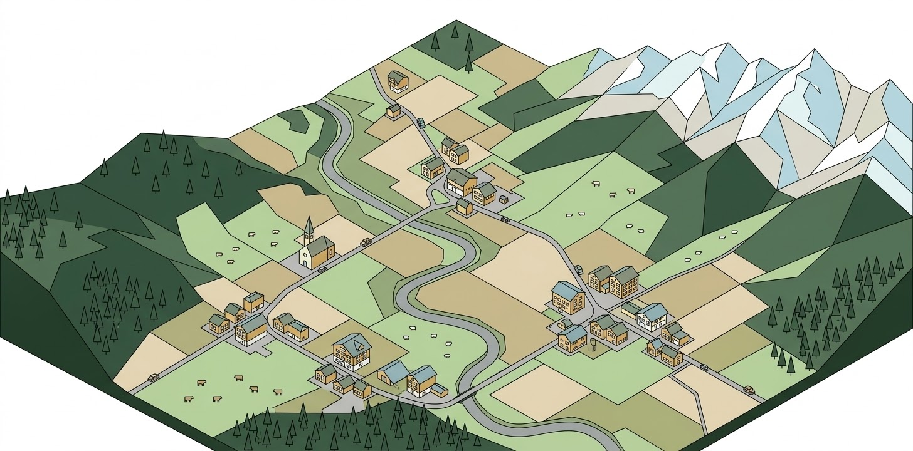

# Landcover Survey



Aggregate land cover usage (m²) per Swiss cadastral parcel from official survey data (Amtliche Vermessung).

For each parcel, the tool clips every intersecting land cover polygon to the parcel boundary and calculates the 2D planar area of each clipped piece on the LV95 projection (EPSG:2056). This produces a breakdown of how much area of each land cover type exists within each parcel.

## Outputs

1. **Parcels** — One row per parcel with identifiers, official and calculated area. In Mode 1, includes user-provided columns and error messages for unresolved EGRIDs.
2. **Land Cover** — One row per clipped land cover feature per parcel with type, area, EGRID, and green space classification.

Output files are CSV, named `{input}_parcels_{timestamp}.csv` and `{input}_landcover_{timestamp}.csv` (e.g. `Liegenschaften_parcels_20260312_195209.csv`). In Mode 2 (no input file), the input prefix is omitted. Both outputs are alphanumeric (no geometry exported). A log file is written to the output directory.

## Modes of Operation

| Mode | Description | Input |
|------|-------------|-------|
| 1 | User-provided parcel list | CSV or Excel with `ID` and `EGRID` columns |
| 2 | Full survey processing | All parcels from the AV GeoPackage (batched by municipality) |

## Requirements

- Python >= 3.10
- Dependencies: `geopandas`, `pandas`, `shapely >= 2.0`, `openpyxl`
- AV GeoPackage (`av_2056.gpkg`) from [geodienste.ch](https://www.geodienste.ch/services/av)

## Installation

```bash
pip install geopandas pandas shapely openpyxl
```

## Usage

Run from the `python/` directory:

```bash
cd python

# Mode 1: User-provided parcel list
python cli.py --mode 1 --input ../data/test_data.csv

# Mode 1: Test with first 10 parcels
python cli.py --mode 1 --input ../data/test_data.csv --limit 10

# Mode 2: All parcels (batched by BFSNr)
python cli.py --mode 2

# Mode 2: Test with first 5 municipalities
python cli.py --mode 2 --limit 5

# Custom GeoPackage and output directory
python cli.py --mode 1 --input parcels.csv --gpkg D:\AV_lv95\av_2056.gpkg --output-dir ../output

# Verbose logging
python cli.py --mode 1 --input ../data/test_data.csv --limit 10 -v
```

### CLI Arguments

| Argument | Default | Description |
|----------|---------|-------------|
| `--mode {1,2}` | `1` | Processing mode |
| `--input PATH` | *(required for Mode 1)* | Path to user CSV or Excel file |
| `--gpkg PATH` | `D:\AV_lv95\av_2056.gpkg` | Path to the AV GeoPackage |
| `--output-dir PATH` | *(input file's directory, or `./data` for Mode 2)* | Output directory for results and log file |
| `--limit N` | *(all)* | Limit processing for testing. Mode 1: first N rows. Mode 2: first N municipalities. |
| `--verbose`, `-v` | off | Enable DEBUG-level logging |

## Input File Format (Mode 1)

| Column | Required | Description |
|--------|----------|-------------|
| `ID` | Yes | User-defined feature identifier |
| `EGRID` | Yes | E-GRID foreign key to look up the official parcel in AV data |
| *(others)* | No | Additional columns are preserved in the parcels output |

## Data Source

Official Swiss cadastral survey data (Amtliche Vermessung), data model DM.01-AV-CH:

- Download: https://www.geodienste.ch/services/av
- Manual: https://www.cadastre-manual.admin.ch/
- CRS: EPSG:2056 (CH1903+ / LV95)

## Project Structure

```
python/                      Python scripts (flat, no package)
  cli.py                     CLI entry point
  config.py                  Constants, BBArt classification, green space mapping
  geometry.py                Geometry cleanup (deaggregate → dissolve → make_valid)
  data_io.py                 Read/write CSV, Excel, GeoPackage
  pipeline.py                Main processing orchestration
data/                        Input and output data
docs/REQUIREMENTS.md         Detailed requirements and data model
fme/                         Original FME workflow (reference only)
```

## Documentation

See [docs/REQUIREMENTS.md](docs/REQUIREMENTS.md) for the full specification including:

- Swiss land cover classification (BBArt) with SIA 416 and green space mappings
- Data model tables and output schemas
- Processing pipeline with Mermaid flowchart
- Architecture and design decisions
- Limitations, error handling, and logging
- Legal framework and references

## License

See [LICENSE](LICENSE).
