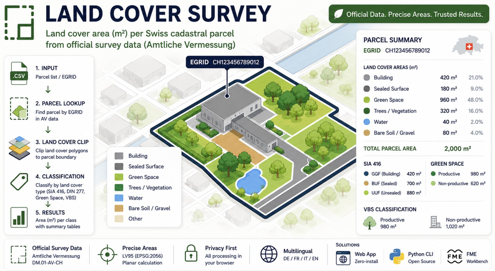
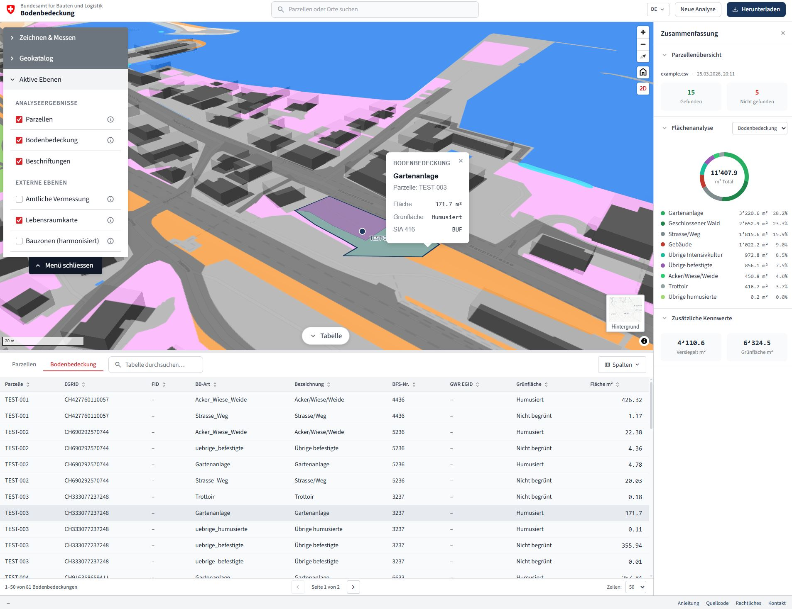
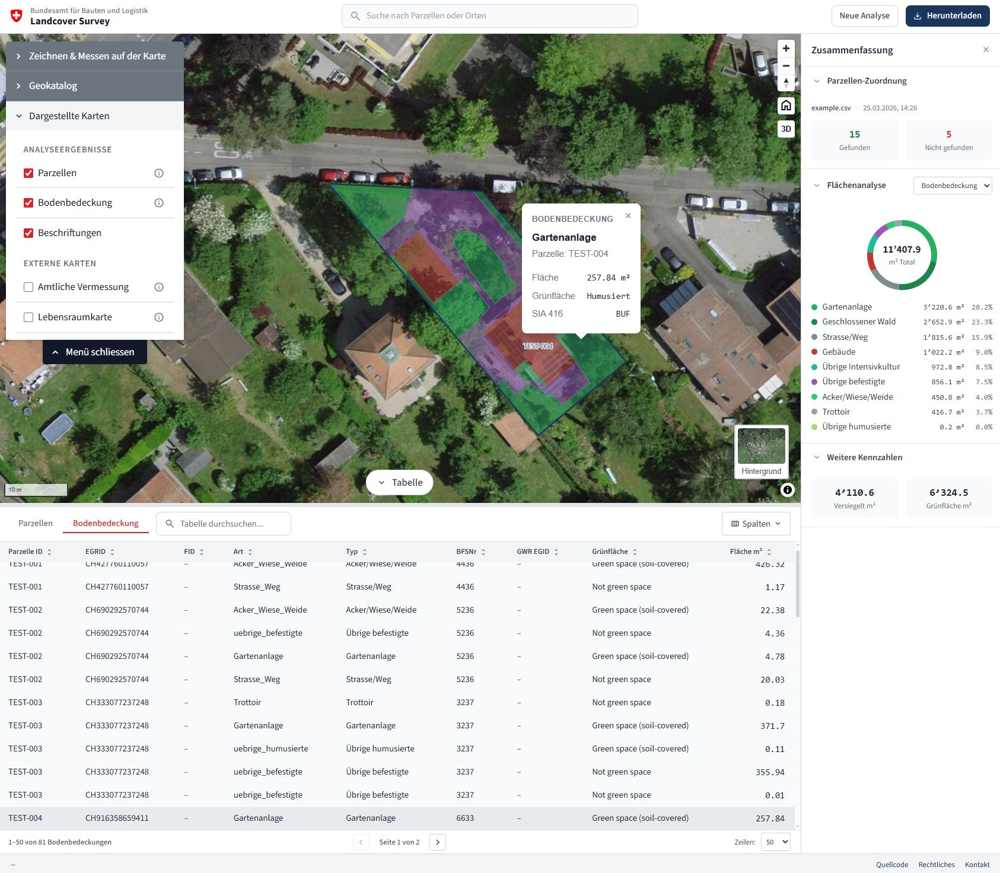

# Land Cover Survey

Aggregate land cover area (m²) per Swiss cadastral parcel from official survey data (Amtliche Vermessung).

<!-- The hero image is clickable and opens the live app -->

> [!TIP]
> **Try it now — open the live web app:** https://bbl-dres.github.io/landcover-survey/
>
> No installation needed; it runs entirely in your browser.

## What is this?

Aggregate land cover area (m²) per Swiss cadastral parcel from official Amtliche Vermessung (AV) data — supports single-parcel EGRID lookup and full municipal batch processing.

For each parcel, the tool clips every intersecting land cover polygon to the parcel boundary and computes the area of each piece — a per-parcel breakdown of how much area each land cover type covers, classified by SIA 416, DIN 277, green space, imperviousness, and VBS categories.

## Solutions

The same analysis is available three ways. Each has its own README with full details.

### Web App

> [!TIP]
> See related repo: https://github.com/bbl-dres/green-inventory

Zero-install browser app: upload a CSV of parcels and explore per-parcel land cover on an interactive map, with export to CSV/Excel/GeoJSON. Multilingual (DE/FR/IT/EN).

- **Preview:** https://bbl-dres.github.io/landcover-survey/
- **Source code:** [`web/`](web/)

  
  

---

### Python CLI

Command-line tool for local, offline processing with exact planar (LV95) areas and full cantonal coverage from a local GeoPackage. Optional Bauzonen and habitat analyses.

- **Preview:** command-line tool — run locally (no hosted demo)
- **Source code:** [`python/`](python/)

---

### FME

The original FME Form workspace (`.fmw`) that the other two solutions reproduce.

- **Preview:** requires [FME Form](https://fme.safe.com/fme-form/) (commercial licence)
- **Source code:** [`fme/`](fme/)

---

## Data & Documentation

> **Data coverage note:** The Web App uses the geodienste.ch WFS, which requires cantonal approval in 6 cantons (JU, LU, NE, NW, OW, VD). Parcels in these cantons are found by EGRID but return 0 m² land cover. Coverage is also incomplete in TI, VS, and NE. The Python CLI has full coverage from a local GeoPackage. See the [User Guide](docs/MANUAL.md) for details.

- **Data source** — official Swiss cadastral survey (Amtliche Vermessung), data model [DM.01-AV-CH](https://www.cadastre-manual.admin.ch/), distributed via [geodienste.ch](https://www.geodienste.ch/services/av). CRS: EPSG:2056 (CH1903+ / LV95).
- **[User Guide](docs/MANUAL.md)** — multilingual manual (DE/FR/IT/EN) with FAQ and data coverage.
- **[Technical Specification](docs/SPECIFICATION.md)** — processing pipeline, data model, full land cover classification (26 BBArt types), and architecture.

## Standards & References

- [SIA 416:2003](https://www.sia.ch/de/dienstleistungen/sia-norm/geodaten/) — building surfaces and volumes (GGF / BUF / UUF)
- [DIN 277:2021](https://www.beuth.de/de/norm/din-277/343199925) — floor areas and building volumes (BF / UF)
- [TVAV (SR 211.432.21)](https://www.fedlex.admin.ch/eli/cc/2023/530/de) — Technical Ordinance on the Official Cadastral Survey (Art. 14–19: land cover categories)
- [GeoIG (SR 510.62)](https://www.fedlex.admin.ch/eli/cc/2008/388/de) — Federal Act on Geoinformation

## License

[MIT](LICENSE) — see [LICENSE](LICENSE).
