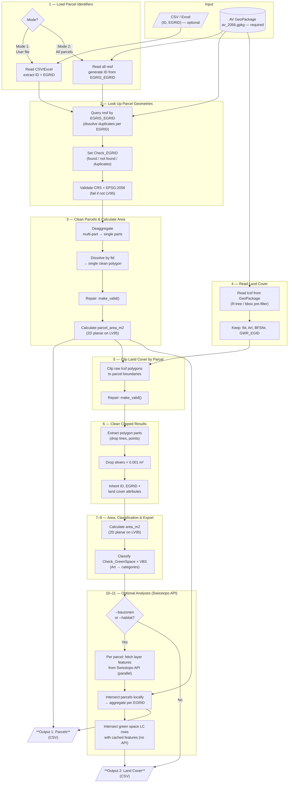

# Architecture & Processing

How the tool turns a parcel identifier into per-parcel land cover areas. For the
classification rules see **[CLASSIFICATION.md](CLASSIFICATION.md)**; for the input
and output schemas see **[DATAMODEL.md](DATAMODEL.md)**.

The project ships **two implementations of the same algorithm**: a **Python CLI**
(batch, from a local GeoPackage) and a **web app** (interactive, from web services).
They share the core — clip land cover to a parcel, compute area, classify — and
differ only in their data source and geometry engine.

## Goal

Calculate **how much area (m²) of each land cover type** lies within each cadastral
parcel. Every land cover polygon that intersects a parcel is clipped to the parcel
boundary; the 2D planar area of each clipped piece is computed on the LV95
projection (EPSG:2056). No reprojection is needed — area on LV95 gives correct
square meters directly.

## At a glance

| | Python CLI | Web app |
|---|------------|---------|
| **Input** | CSV/Excel of EGRIDs (Mode 1) or every parcel (Mode 2) | One parcel — click the map, search, or upload a CSV |
| **Parcel + land cover source** | Local AV GeoPackage (`av_2056.gpkg`) | geo.admin.ch `find` + geodienste.ch WFS (`ms:LCSF`), fetched per parcel |
| **Geometry engine** | Shapely / GeoPandas | Turf.js |
| **Scale** | Up to ~3.5M parcels (batched by municipality) | Interactive, a few parcels at a time |
| **Bauzonen / BAFU habitat** | Optional (`--bauzonen` / `--habitat`) | Always analysed, as separate overlay layers |
| **Output** | Parcels CSV + Land Cover CSV | CSV · Excel · GeoJSON · HTML report |

The rest of this document describes the **shared core** once, then the
**[Python CLI](#python-cli)** and **[web app](#web-app)** deltas.

---

## Shared core

Both implementations run the same logical pipeline: look up the parcel geometry,
read the land-cover polygons overlapping it, clip them to the parcel boundary, then
compute area and classify each clipped piece.

### Processing pipeline

> The diagram shows the **Python CLI** flow. The nodes naming the GeoPackage,
> `resf`/`lcsf`, and Mode 1/2 are the CLI's binding of these steps; the **web app**
> runs the same clip → area → classify core **per parcel**, sourcing geometry and
> land cover from web services instead (see [Web app](#web-app)). Steps 10–11 are
> opt-in on the CLI but always-on in the web app.

#### Step notes

1. **Load parcel identifiers** — Mode 1 reads `ID`/`EGRID` (+ extra columns) from
   the user file; Mode 2 enumerates all `resf` features. *(Web app: a single EGRID
   from the picker, search box, or CSV row.)*
2. **Look up parcel geometry** — dissolve duplicate EGRIDs into one polygon, set
   `Check_EGRID`, validate CRS = EPSG:2056. *(CLI queries the GeoPackage `resf`;
   web app calls geo.admin.ch `find`.)*
3. **Clean parcels & area** — geometry cleanup (below), then `parcel_area_m2`.
4. **Read land cover** — keep `fid`, `Art`, `BFSNr`, `GWR_EGID`. *(CLI reads `lcsf`
   from the GeoPackage with an R-tree / bbox pre-filter; web app fetches `ms:LCSF`
   from the geodienste.ch WFS by parcel bbox.)*
5. **Clip** — intersect raw land cover against the parcel, then repair the results.
6. **Clean clipped results** — keep only Polygon/MultiPolygon parts (an intersection
   can return a mixed `GeometryCollection`); drop slivers < 0.001 m²; inherit
   `ID`/`EGRID` + land cover attributes.
7–9. **Area + classify + export** — `area_m2`, then `Check_GreenSpace` and the three
   VBS columns ([CLASSIFICATION.md](CLASSIFICATION.md)). Geometry stays internal: the
   CLI's CSVs carry none, while the web app re-attaches it for the GeoJSON export.
10–11. **Optional overlay analyses** — Bauzonen + BAFU habitat (CLI: opt-in; web app:
   always — see each platform below).

### Geometry cleanup

Survey polygons can have self-intersections, multi-part geometries, or slivers.
**Parcel** geometries are cleaned **before** clipping, in three steps:

1. **Deaggregate** — split multi-part geometries into single parts.
2. **Dissolve** — merge parts back into one polygon per `fid` (survey feature ID).
3. **Repair** — fix invalid geometries via `make_valid()` (not `buffer(0)`, which
   can collapse narrow polygons).

**Land cover** geometries are **not** cleaned before clipping (matching the original
FME workflow); instead the clipped results are repaired and filtered afterwards —
non-polygon artifacts and slivers < 0.001 m² are dropped.

---

## Python CLI

Batch processing from a **local AV GeoPackage** with Shapely / GeoPandas.

### Modes

- **Mode 1 — user file:** read `ID`/`EGRID` (+ any extra columns, preserved) from a
  CSV/Excel and **left-join** onto the results, so unfound EGRIDs still produce a row
  (with a `Check_EGRID` error and null area — mirrors the FME FeatureJoiner).
- **Mode 2 — all parcels:** enumerate every `resf` feature, generating `ID` from
  `EGRIS_EGRID`. Processed one municipality (`BFSNr`) at a time to bound memory.

### Optional Swisstopo layer analyses

With `--bauzonen` or `--habitat`, the pipeline runs additional intersections via the
[geo.admin.ch Identify API](https://docs.geo.admin.ch/access-data/identify-features.html):

1. **Fetch per parcel** — Identify is called with the parcel polygon as the spatial
   filter (parallel, up to 10 concurrent; bbox fallback for high-vertex polygons;
   cached by EGRID).
2. **Intersect parcels** — locally with Shapely; aggregated per EGRID as
   semicolon-separated names and areas.
3. **Intersect green-space land covers** — each green-space LC row against the
   **cached** features of its parent parcel (no extra API calls).
4. **Merge** — joined onto the outputs as `{label}` / `{label}_m2` columns.

Available layers: **Bauzonen** (`ch.are.bauzonen`) and **Habitat**
(`ch.bafu.lebensraumkarte-schweiz`); new layers are added via a `LayerConfig` in
`swisstopo.py`. For large runs (Mode 2 or thousands of parcels), download the
datasets locally rather than hitting the API per parcel.

### Dependencies

- `geopandas` — GeoPackage reading, spatial ops (clip, dissolve, area)
- `pandas` — tabular data, CSV/Excel I/O
- `shapely` (>= 2.0) — geometry ops (`make_valid()`, intersection)
- `openpyxl` — Excel (.xlsx) input

### Module responsibilities

| Module | Responsibility |
|--------|----------------|
| `main.py` | Parse args, configure logging, call the pipeline |
| `config.py` | Pure constants: BBArt domain, classification maps (SIA416/DIN277/green/sealed/VBS), default paths, thresholds |
| `geometry.py` | `clean_geometries()` (deaggregate → dissolve → make_valid) and `filter_clip_results()` (drop non-polygons + slivers) |
| `data_io.py` | All file I/O; validates `ID`/`EGRID` and EGRID format before SQL |
| `pipeline.py` | Orchestrates Mode 1/2, clipping, aggregation, layer analyses |
| `swisstopo.py` | Generic geo.admin.ch Identify client (fetch, cache, intersect) |
| `bauzonen.py` / `habitat.py` | Thin `LayerConfig` wrappers around `swisstopo.py` |

### Performance & scale

- **Mode 2 processes ~3.5M parcels** — loading all land cover at once isn't
  feasible, so it batches by municipality (`BFSNr`) to keep memory bounded.
- **SQL-level filtering** (`where="EGRIS_EGRID IN (...)"`) avoids full-table loads —
  critical for Mode 1 against a ~3.5M-row table; batch large EGRID lists (~500 per
  `IN` clause).
- An **R-tree** spatial index on the GeoPackage speeds up land cover lookups.
- A full Mode 2 run is I/O- and compute-intensive (hours on a workstation; no
  parallelization). The national GeoPackage is ~15–20 GB and should be on
  fast-access storage.

### Error handling & logging

**Fail-soft:** individual feature errors are logged and flagged in the output but do
not halt processing. Only systemic errors abort.

| Situation | Behaviour |
|-----------|-----------|
| EGRID not found in AV | Row kept; `Check_EGRID` = error, `parcel_area_m2` = null |
| Duplicate EGRIDs | Geometries dissolved; `Check_EGRID` = "... (n entries merged)" |
| `make_valid()` returns empty | Feature kept with zero area; logged WARNING |
| Clip produces only lines/points | Feature dropped; logged DEBUG |
| Clip produces sliver < 0.001 m² | Feature dropped; logged DEBUG |
| Unknown `Art` value | Feature kept; defaults applied; logged WARNING |
| CRS ≠ EPSG:2056 | **Abort** (`ValueError`) |
| Input missing `ID`/`EGRID` | **Abort** (`ValueError`) |
| GeoPackage missing/unreadable | **Abort** |

| Level | Content |
|-------|---------|
| `ERROR` | Unrecoverable failures (wrong CRS, missing file/columns) |
| `WARNING` | Data quality issues (empty geometries, unknown Art, zero-area parcels) |
| `INFO` | Progress milestones (rows read, municipalities processed, files written) |
| `DEBUG` | Per-feature details (dropped slivers/non-polygons, SQL queries) |

Default level is `INFO`; `--verbose` / `-v` for `DEBUG`. Logs go to console and
`<output-dir>/{prefix}{timestamp}.log`.

---

## Web app

Interactive, **browser-only** (no backend), one parcel at a time. Geometry comes
from web services and clipping/area run on Turf.js; see [At a glance](#at-a-glance)
for the contrast with the CLI.

### Per-parcel data flow

1. **Resolve the parcel** — EGRID → geometry via the geo.admin.ch `find` endpoint
   (driven by the map picker, search box, or an uploaded CSV row).
2. **Fetch land cover** — `ms:LCSF` surfaces overlapping the parcel **bbox** from the
   geodienste.ch AV WFS (GetFeature, GeoJSON, capped at 1000 features).
3. **Clip & area** — Turf.js intersects each surface with the exact parcel boundary
   and sums `area_m2`; classification is identical to the CLI ([Shared core](#shared-core)).
4. **Overlays** — Bauzonen + BAFU habitat are fetched and analysed in parallel (below).

Calls are fired per parcel with an `AbortController` timeout and retries; a failed
WFS fetch flags the parcel as "land cover unavailable" rather than silently zero.

### Overlays: Bauzonen + BAFU habitat

The web app **always** analyses two overlays alongside AV land cover, each via the
geo.admin.ch Identify endpoint, clipped to the parcel and exported as its own GeoJSON
`layer` / Excel sheet:

- **Bauzonen** (`ch.are.bauzonen`) — harmonised building-zone main-use category
  (`ch_code_hn`), aggregated per parcel.
- **BAFU Lebensraumkarte** (`ch.bafu.lebensraumkarte-schweiz`) — habitats classified
  by **TypoCH level-1** (the leading digit of `typoch_de`), `lc_source = BAFU`. BAFU
  rows derive only green space + VBS; SIA 416 / DIN 277 / sealed are left blank
  because a modeled habitat map can't resolve building footprints. The
  TypoCH→classification mapping lives in `BAFU_TYPOCH_L1`
  ([web/js/config.js](../web/js/config.js)); rules and caveats are in
  [CLASSIFICATION.md](CLASSIFICATION.md) §BAFU Lebensraumkarte.

> **BAFU is not a fallback.** Earlier the web app substituted BAFU where AV was
> missing; it no longer does. AV land cover stays pure AV, so parcels in no-coverage
> cantons show empty (0 m²) land cover and BAFU is a separate, parallel layer. The
> Python CLI has neither behaviour — it reads a full local GeoPackage.

### External APIs & data sources

Everything runs in the browser — there is no backend. All requests are anonymous,
read-only `GET`s (no API key). Federal geodata is served by the geo.admin.ch
geoportal; AV land cover comes from geodienste.ch.

**geo.admin.ch REST services** — base `https://api3.geo.admin.ch/rest/services`:

| Endpoint | Source | Type | How the web app uses it | Layer(s) | Code |
|----------|--------|------|-------------------------|----------|------|
| `…/all/MapServer/find` | [docs.geo.admin.ch](https://docs.geo.admin.ch) | JSON | Resolve a parcel by EGRID (`searchField=egris_egrid`) → geometry + parcel number | `ch.kantone.cadastralwebmap-farbe` | `processor.js`, `parcelpicker.js` |
| `…/all/MapServer/identify` | [docs.geo.admin.ch](https://docs.geo.admin.ch) | JSON | Click-to-identify the parcel under the cursor; intersect the parcel envelope with the building-zone and habitat overlays | `ch.kantone.cadastralwebmap-farbe`, `ch.are.bauzonen`, `ch.bafu.lebensraumkarte-schweiz` | `processor.js`, `parcelpicker.js` |
| `…/ech/SearchServer` | [docs.geo.admin.ch](https://docs.geo.admin.ch) | JSON | Address / place / parcel search box (`type=locations`) | — | `parcelpicker.js` |
| `…/all/MapServer/layersConfig?lang=…` | [docs.geo.admin.ch](https://docs.geo.admin.ch) | JSON | Look up how to render a user-added layer (WMTS vs WMS, format, timestamp) | any | `swisstopo.js` |
| `…/ech/CatalogServer?lang=…` | [docs.geo.admin.ch](https://docs.geo.admin.ch) | JSON | Build the Geokatalog layer tree (browse & add any geo.admin.ch layer) | any | `swisstopo.js` |
| `…/api/MapServer/{id}/legend?lang=…` | [docs.geo.admin.ch](https://docs.geo.admin.ch) | HTML | Legend + metadata in the layer-info modal (sanitised before injection) | any | `swisstopo.js` |

**Map tiles & feature services:**

| Service (URL template) | Source | Type | How the web app uses it | Layer / typename |
|------------------------|--------|------|-------------------------|------------------|
| `wmts.geo.admin.ch/1.0.0/ch.swisstopo.swissimage/default/current/3857/{z}/{x}/{y}.jpeg` | [docs.geo.admin.ch](https://docs.geo.admin.ch) | WMTS | "Luftbild" aerial basemap option + thumbnail | `ch.swisstopo.swissimage` |
| `wmts.geo.admin.ch/1.0.0/{layerId}/default/{time}/3857/{z}/{x}/{y}.{fmt}` | [docs.geo.admin.ch](https://docs.geo.admin.ch) | WMTS | Render user-added overlays that `layersConfig` reports as `wmts` | any |
| `wms.geo.admin.ch/?…REQUEST=GetMap&LAYERS=ch.kantone.cadastralwebmap-farbe&CRS=EPSG:3857&BBOX={bbox-epsg-3857}…` | [docs.geo.admin.ch](https://docs.geo.admin.ch) | WMS | Cadastral parcel overlay on the picker map | `ch.kantone.cadastralwebmap-farbe` |
| `wms.geo.admin.ch/?…REQUEST=GetMap&LAYERS={layers}…` | [docs.geo.admin.ch](https://docs.geo.admin.ch) | WMS | Render user-added overlays that `layersConfig` reports as `wms`/aggregate | any |
| `geodienste.ch/db/av_0/{deu\|fra\|ita\|eng}?…REQUEST=GetFeature&TYPENAMES=ms:LCSF&COUNT=1000` | [geodienste.ch](https://geodienste.ch) | WFS | Fetch official AV land-cover surfaces in the parcel bbox, then clip client-side with Turf.js | `ms:LCSF` |

**Third-party CDN assets** (loaded directly in the browser):

| Asset | Used for | Source |
|-------|----------|--------|
| MapLibre GL JS 4.7.1 | Map rendering | `unpkg.com` |
| Turf.js 7 | Client-side geometry clip + area | `unpkg.com` |
| SheetJS (`xlsx`) 0.18.5 | Excel import/export (loaded on demand) | `cdn.jsdelivr.net` |
| CARTO basemaps (positron / voyager / dark-matter GL styles + raster thumbnails) | Vector/raster basemaps | `basemaps.cartocdn.com` |
| Google Fonts (Source Sans 3, Material Symbols) | Typography + icons | `fonts.googleapis.com` |

**Attribution / accreditation:**

- **geo.admin.ch / swisstopo** — all `*.geo.admin.ch` services are the Swiss
  Confederation's federal geoportal; attribution **© swisstopo** is shown on the map
  for every layer. Data owners of the specific layers used:
  - `ch.kantone.cadastralwebmap-farbe` — cantonal cadastral survey (AV).
  - `ch.are.bauzonen` — **ARE** (Federal Office for Spatial Development), harmonised
    building zones.
  - `ch.bafu.lebensraumkarte-schweiz` — **BAFU/FOEN** (Federal Office for the
    Environment), Habitat Map of Switzerland (TypoCH).
  - `ch.swisstopo.swissimage` — **swisstopo** orthophoto mosaic.
- **AV land cover (`ms:LCSF`)** — Official Cadastral Survey, owned by the cantons and
  distributed via **geodienste.ch** (operated by the KGK-CGC).
- **CARTO basemaps** — © OpenStreetMap contributors, © CARTO.
- Federal geodata is published as Open Government Data; reuse requires citing the
  source (see [geo.admin.ch terms of use](https://www.geo.admin.ch/en/general-terms-of-use-fsdi)).

### Coverage gaps

The geodienste.ch WFS requires cantonal approval; in **6 cantons (JU, LU, NE, NW, OW,
VD)** parcels are found by EGRID but return **0 m² AV land cover** (coverage is also
incomplete in TI, VS, NE). The BAFU overlay still renders there but does **not** fill
the AV gap (see above). The Python CLI has full coverage from the local GeoPackage.
See [MANUAL.md](MANUAL.md).

---

## Limitations

Cross-cutting caveats; platform-specific limits live under
[Python CLI → Performance & scale](#performance--scale) and
[Web app → Coverage gaps](#coverage-gaps).

### Geometry & area accuracy
- **Calculated vs. legal area** — `parcel_area_m2` will not match `Flaechenmass`
  exactly; the tool does not replace the official area.
- **Sliver threshold** — clip results < 0.001 m² are silently dropped.
- **Topology gaps** — source data is not guaranteed topologically clean; clipped LC
  areas may not sum exactly to the parcel area.

### Data model
- **GeoPackage completeness (CLI)** — cantons deliver AV data independently; some may
  be missing or outdated. Missing municipalities produce no rows, not errors.
- **DMAV transition** — DM.01-AV-CH is replaced by DMAV by 2027-12-31; BBArt values
  and `resf`/`lcsf` schemas may change.
- **SDR without geometry** — some SDR entries carry an EGRID but no polygon; these are
  treated as "not found".
