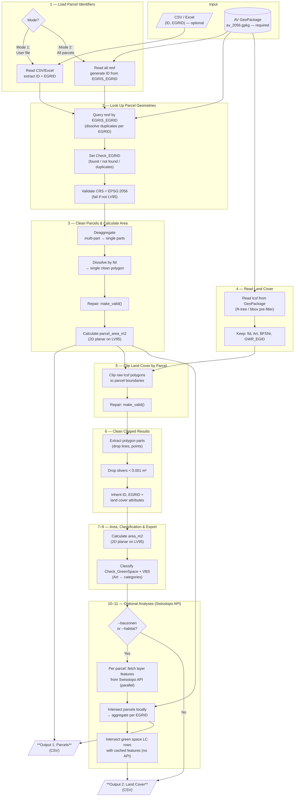

# Architecture & Processing

How the tool turns a parcel identifier into per-parcel land cover areas. For the
classification rules see **[CLASSIFICATION.md](CLASSIFICATION.md)**; for the input
and output schemas see **[DATAMODEL.md](DATAMODEL.md)**.

## Goal

Calculate **how much area (m²) of each land cover type** lies within each cadastral
parcel. The tool clips every land cover polygon that intersects a parcel to the
parcel boundary, then computes the 2D planar area of each clipped piece on the
LV95 projection (EPSG:2056). No reprojection is needed — `geometry.area` on LV95
gives correct square meters directly.

---

## Geometry cleanup

Survey polygons can have self-intersections, multi-part geometries, or slivers.
Parcel geometries go through a three-step cleanup **before** clipping:

1. **Deaggregate** — split multi-part geometries into single parts.
2. **Dissolve** — merge parts back into one polygon per `fid` (survey feature ID).
3. **Repair** — fix invalid geometries via `shapely.make_valid()` (not
   `buffer(0)`, which can collapse narrow polygons).

Land cover geometries are **not** cleaned before clipping (matching the original
FME workflow). Instead the clipped results are repaired and filtered afterwards —
non-polygon artifacts and slivers < 0.001 m² are dropped.

---

## Processing pipeline

### Step notes

1. **Load parcel identifiers** — Mode 1 reads `ID`/`EGRID` (+ extra columns) from
   the user file; Mode 2 enumerates all `resf` features.
2. **Look up parcel geometries** — query `resf` by `EGRIS_EGRID`, dissolve
   duplicate EGRIDs into one polygon, set `Check_EGRID`, validate CRS = EPSG:2056.
3. **Clean parcels & area** — deaggregate + dissolve + `make_valid()`, then
   `parcel_area_m2`. Write Parcels output.
4. **Read land cover** — read `lcsf` with R-tree / bbox pre-filter; keep `fid`,
   `Art`, `BFSNr`, `GWR_EGID`.
5. **Clip** — vectorised `shapely.intersection()` of raw LC against the parcel,
   then `make_valid()` on the results.
6. **Clean clipped results** — keep only Polygon/MultiPolygon parts; drop slivers
   < 0.001 m²; inherit `ID`/`EGRID` + LC attributes.
7–9. **Area + classify + export** — `area_m2`, then `Check_GreenSpace` and the
   three VBS columns ([CLASSIFICATION.md](CLASSIFICATION.md)). Write Land Cover output.
10–11. **Optional Swisstopo analyses** — see below.

### Optional Swisstopo layer analyses (Python)

With `--bauzonen` or `--habitat`, the pipeline runs additional intersections via
the [Swisstopo REST API](https://api3.geo.admin.ch):

1. **Fetch per parcel** — the [Identify endpoint](https://docs.geo.admin.ch/access-data/identify-features.html)
   is called with the parcel polygon as the spatial filter (parallel, up to 10
   concurrent; bbox fallback for high-vertex polygons; cached by EGRID).
2. **Intersect parcels** — locally with Shapely; aggregated per EGRID as
   semicolon-separated names and areas.
3. **Intersect green-space land covers** — each green-space LC row against the
   **cached** features of its parent parcel (no extra API calls).
4. **Merge** — joined onto the outputs as `{label}` / `{label}_m2` columns.

Available layers: **Bauzonen** (`ch.are.bauzonen`) and **Habitat**
(`ch.bafu.lebensraumkarte-schweiz`). New layers are added via a `LayerConfig` in
`swisstopo.py`.

> For large-scale work (Mode 2 or thousands of parcels), download the datasets
> locally rather than hitting the API per parcel.

### BAFU land cover fallback (web app only)

The geodienste WFS doesn't cover every canton. When `fetchLandCover()` returns
**zero AV features** for a parcel, the web app queries the **BAFU Lebensraumkarte**
(`ch.bafu.lebensraumkarte-schweiz`) via the geo.admin.ch Identify endpoint, clips
those habitat polygons to the parcel, and classifies them by **TypoCH level-1**
class (the leading digit of `typoch_de`). This is **per-parcel and self-correcting**
— it covers no-access cantons *and* coverage gaps without a hardcoded canton list.

A parcel is wholly AV **or** wholly BAFU (never mixed). BAFU rows derive only green
space + VBS; SIA 416 / DIN 277 / sealed are left blank because a modeled habitat map
can't resolve building footprints. The source is recorded in `lc_source`
(`AV` / `BAFU`). The TypoCH→classification mapping lives in `BAFU_TYPOCH_L1`
([web/js/config.js](../web/js/config.js)); rules and caveats are in
[CLASSIFICATION.md](CLASSIFICATION.md) §Fallback. The Python CLI has no fallback —
it reads a full local GeoPackage.

---

## Implementation

### Dependencies (Python CLI)
- `geopandas` — GeoPackage reading, spatial ops (clip, dissolve, area)
- `pandas` — tabular data, CSV/Excel I/O
- `shapely` (>= 2.0) — geometry ops (`make_valid()`, intersection)
- `openpyxl` — Excel (.xlsx) input

The web app uses **Turf.js** for clipping/area and **MapLibre GL** for display —
no build step, static ES modules.

### Performance
- **Mode 2** processes ~3.5M Swiss parcels — loading all land cover at once is not
  feasible. Municipality-level batching (by `BFSNr`) keeps memory bounded.
- An **R-tree** spatial index on the GeoPackage speeds up land cover lookups.
- SQL-level filtering (`where="EGRIS_EGRID IN (...)"`) avoids full table loads;
  batch large EGRID lists (~500 per `IN` clause).

---

## Module responsibilities (Python)

| Module | Responsibility |
|--------|----------------|
| `main.py` | Parse args, configure logging, call the pipeline |
| `config.py` | Pure constants: BBArt domain, classification maps (SIA416/DIN277/green/sealed/VBS), default paths, thresholds |
| `geometry.py` | `clean_geometries()` (deaggregate → dissolve → make_valid) and `filter_clip_results()` (drop non-polygons + slivers) |
| `data_io.py` | All file I/O; validates `ID`/`EGRID` and EGRID format before SQL |
| `pipeline.py` | Orchestrates Mode 1/2, clipping, aggregation, layer analyses |
| `swisstopo.py` | Generic geo.admin.ch Identify client (fetch, cache, intersect) |
| `bauzonen.py` / `habitat.py` | Thin `LayerConfig` wrappers around `swisstopo.py` |

## Key design decisions
- **SQL-level filtering** over full table loads — critical for Mode 1 against a
  ~3.5M row table.
- **BFSNr batching (Mode 2)** — one municipality at a time keeps memory bounded.
- **Left join (Mode 1)** — unfound EGRIDs produce rows with a `Check_EGRID` error
  and null area; user columns are always preserved (mirrors FME FeatureJoiner).
- **No geometry in outputs** — geometry is internal; dropped before CSV export.
- **Parcel cleanup before clip, LC cleanup after** — matches FME; avoids cleaning
  millions of LC features upfront.
- **GeometryCollection handling** — `shapely.intersection()` can return mixed
  collections; extract only Polygon/MultiPolygon parts.

---

## Limitations

### Data coverage
- **GeoPackage completeness** — cantons deliver AV data independently; some may be
  missing or outdated. Missing municipalities produce no rows, not errors.
- **Web app WFS coverage** — the geodienste.ch WFS requires cantonal approval in
  6 cantons (JU, LU, NE, NW, OW, VD); those parcels are found by EGRID but return
  0 m² AV land cover (coverage also incomplete in TI, VS, NE). The web app then
  **falls back to the BAFU Lebensraumkarte** for those parcels (see below). The
  Python CLI has full coverage from the local GeoPackage. See [MANUAL.md](MANUAL.md).
- **DMAV transition** — DM.01-AV-CH is replaced by DMAV by 2027-12-31; BBArt
  values and `resf`/`lcsf` schemas may change.
- **SDR without geometry** — some SDR entries carry an EGRID but no polygon; these
  are treated as "not found".

### Geometry & area accuracy
- **Calculated vs. legal area** — `parcel_area_m2` will not match `Flaechenmass`
  exactly; the tool does not replace the official area.
- **Sliver threshold** — clip results < 0.001 m² are silently dropped.
- **Topology gaps** — source data is not guaranteed topologically clean; clipped
  LC areas may not sum exactly to the parcel area.

### Performance
- **Mode 2 runtime** — processing all ~3.5M parcels is I/O- and compute-intensive
  (hours on a workstation; no parallelization). The national GeoPackage is ~15–20 GB
  and must be on fast-access storage.

---

## Error handling & logging

**Fail-soft:** individual feature errors are logged and flagged in the output but
do not halt processing. Only systemic errors abort.

| Situation | Behaviour |
|-----------|-----------|
| EGRID not found in AV | Row kept; `Check_EGRID` = error, `parcel_area_m2` = null |
| Duplicate EGRIDs | Geometries dissolved; `Check_EGRID` = "... (n entries merged)" |
| `make_valid()` returns empty | Feature kept with zero area; logged WARNING |
| Clip produces only lines/points | Feature dropped; logged DEBUG |
| Clip produces sliver < 0.001 m² | Feature dropped; logged DEBUG |
| Unknown `Art` value | Feature kept; defaults applied; logged WARNING |
| CRS ≠ EPSG:2056 | **Abort** (`ValueError`) |
| Input missing `ID`/`EGRID` | **Abort** (`ValueError`) |
| GeoPackage missing/unreadable | **Abort** |

| Level | Content |
|-------|---------|
| `ERROR` | Unrecoverable failures (wrong CRS, missing file/columns) |
| `WARNING` | Data quality issues (empty geometries, unknown Art, zero-area parcels) |
| `INFO` | Progress milestones (rows read, municipalities processed, files written) |
| `DEBUG` | Per-feature details (dropped slivers/non-polygons, SQL queries) |

Default level is `INFO`; `--verbose` / `-v` for `DEBUG`. Logs go to console and
`<output-dir>/{prefix}{timestamp}.log`.
