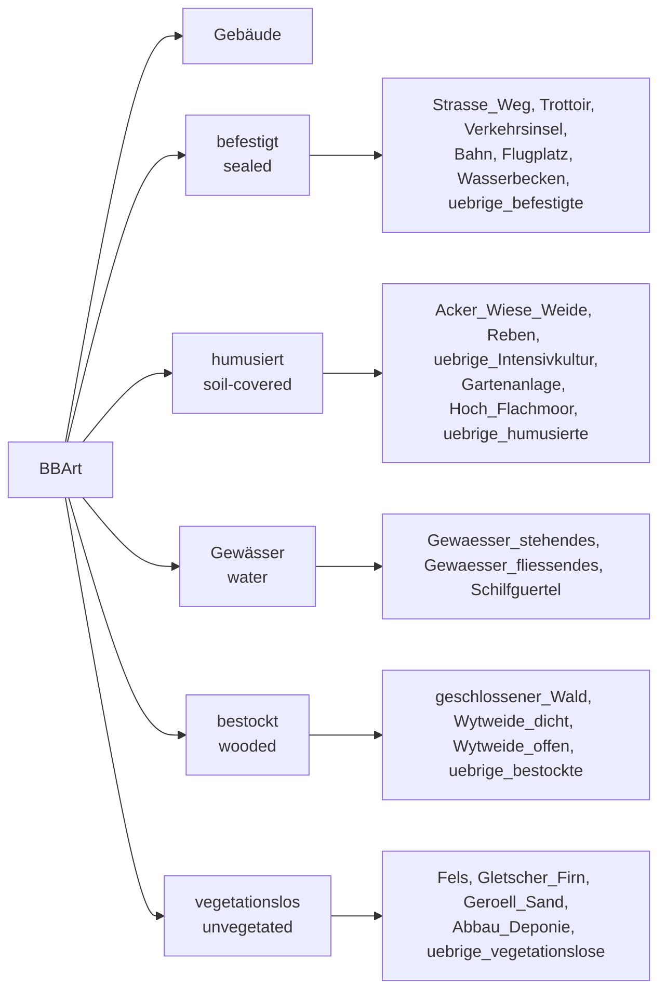

# Land Cover Classification (AV BBArt)

How each Swiss land cover type (*Bodenbedeckungsart*, **BBArt**) maps to the area
categories this tool reports. **This is the reference most users want.**

The 26 BBArt types are defined in the Swiss data model **DM.01-AV-CH** as the
`BBArt` domain — a national classification (not INSPIRE or CORINE) set out in the
technical ordinance on official surveying (TVAV, SR 211.432.21, Art. 14–19). The
data model will be replaced by **DMAV** by 2027-12-31.

For each clipped land cover piece, the tool assigns it to **five** classification
schemes. This page explains each one, with the full lookup table at the end.

| Scheme | Output | What it answers |
|--------|--------|-----------------|
| **SIA 416** | GGF / BUF / UUF | Building footprint vs. developed vs. undeveloped surroundings |
| **DIN 277** | BF / UF | Built-up vs. unbuilt |
| **Green space** | soil-covered / wooded / none | Is it green space? |
| **Sealed** | yes / no | Is the surface sealed (impervious)? |
| **VBS** | Kategorie a–d · produktiv 1/2 · Typ 1/2 | Near-natural area reporting for VBS/arImmo |

> Where these land up in the output files (which column, which table), see
> **[DATAMODEL.md](DATAMODEL.md)**. How the geometry is clipped and areas are
> computed, see **[ARCHITECTURE.md](ARCHITECTURE.md)**.

---

## The BBArt hierarchy

The 26 leaf types group into six main categories (INTERLIS structure of
DM.01-AV-CH). This is the "AV layer map":



Formal INTERLIS definition:

```
BBArt = (
  Gebaeude,
  befestigt (
    Strasse_Weg, Trottoir, Verkehrsinsel, Bahn,
    Flugplatz, Wasserbecken, uebrige_befestigte),
  humusiert (
    Acker_Wiese_Weide,
    Intensivkultur (Reben, uebrige_Intensivkultur),
    Gartenanlage, Hoch_Flachmoor, uebrige_humusierte),
  Gewaesser (
    stehendes, fliessendes, Schilfguertel),
  bestockt (
    geschlossener_Wald,
    Wytweide (Wytweide_dicht, Wytweide_offen),
    uebrige_bestockte),
  vegetationslos (
    Fels, Gletscher_Firn, Geroell_Sand,
    Abbau_Deponie, uebrige_vegetationslose));
```

---

## SIA 416 — building & surrounding areas

[SIA 416:2003](https://www.sia.ch/de/dienstleistungen/sia-norm/geodaten/). The
total parcel area **GSF** (*Grundstücksfläche*) = **GGF** + **UF**, where
**UF** (*Umgebungsfläche*) = **BUF** + **UUF**.

- **GGF** — `Gebaeude` (building footprint).
- **BUF** — all *befestigt* and *humusiert* types, incl. Wytweide (developed surroundings).
- **UUF** — everything else: water, wooded, and unvegetated types (undeveloped surroundings).

> **Note:** `Wytweide_dicht`/`Wytweide_offen` are officially *bestockt* (wooded)
> but counted as **BUF** here — actively managed pasture is *bearbeitet*.

---

## DIN 277 — built-up vs. unbuilt

[DIN 277:2021](https://www.beuth.de/de/norm/din-277/343199925). Trivial split:

- **BF** (*Bebaute Fläche* / built-up) — `Gebaeude` only.
- **UF** (*Unbebaute Fläche* / unbuilt) — everything else.

---

## Green space

Project-specific classification, following the AV *humusiert* (soil-covered) and
*bestockt* (wooded) groups with two deliberate exceptions:

- **Wytweide** (`Wytweide_dicht`, `Wytweide_offen`) — officially *bestockt*, but
  treated as **soil-covered** green space because pasture dominates over tree cover.
- **`uebrige_Intensivkultur`** — officially *humusiert*, but classified as **not**
  green space (managed horticulture: orchards, nurseries).

| Green Space Category | DE | `Art` Values |
|---------------------|-----|-------------|
| Green space (soil-covered) | Grünfläche (Humusiert) | `Acker_Wiese_Weide`, `Gartenanlage`, `Reben`, `Hoch_Flachmoor`, `uebrige_humusierte`, `Wytweide_dicht`, `Wytweide_offen` |
| Green space (wooded) | Grünfläche (Bestockt) | `geschlossener_Wald`, `uebrige_bestockte` |
| Not green space | Keine Grünfläche | All others |

---

## Sealed (imperviousness)

Sealed = `Gebaeude` + all *befestigt* types. A flat set:

`Gebaeude`, `Strasse_Weg`, `Trottoir`, `Verkehrsinsel`, `Bahn`, `Flugplatz`,
`Wasserbecken`, `uebrige_befestigte`.

Everything else is unsealed.

---

## VBS — naturnahe Flächen

Based on the arImmo internal document *"Auswertung naturnahe VBS Flächen"*. Three
**layers**, applied in order. The key subtlety: **Typ exists only within
biologically productive area** — biologically unproductive types get no Typ.

### Layer 1 — VBS Kategorie (base category a–d)

| VBS Kategorie | `Art` Values |
|---------------|-------------|
| **A. Siedlungsfläche** | `Gebaeude`, `Strasse_Weg`, `Trottoir`, `Verkehrsinsel`, `Bahn`, `Flugplatz`, `Wasserbecken`, `uebrige_befestigte`, `Abbau_Deponie` |
| **B. Landwirtschaftsfläche** | `Acker_Wiese_Weide`, `Reben`, `uebrige_Intensivkultur`, `Gartenanlage`, `uebrige_humusierte`, `Wytweide_dicht`, `Wytweide_offen` |
| **C. Bestockte Fläche** | `geschlossener_Wald`, `uebrige_bestockte` |
| **D. Unproduktive Fläche** | `Hoch_Flachmoor`, `Gewaesser_stehendes`, `Gewaesser_fliessendes`, `Schilfguertel`, `Fels`, `Gletscher_Firn`, `Geroell_Sand`, `uebrige_vegetationslose` |

> **Note:** `Abbau_Deponie` sits in *D. Unproduktive Fläche* in the AV hierarchy
> but VBS counts it as *A. Siedlungsfläche*.

### Layer 2 — Biological productivity

| Category | Rule |
|----------|------|
| **1 Biologisch produktiv** | B + C + D **minus** `Fels`, `Gletscher_Firn`, `Geroell_Sand` |
| **2 Biologisch unproduktiv** | A **plus** `Fels`, `Gletscher_Firn`, `Geroell_Sand` |

> `Fels`, `Gletscher_Firn`, `Geroell_Sand` belong to *D. Unproduktive Fläche* but
> are reclassified as biologically unproductive — mineral, non-vegetated surfaces.

### Layer 3 — VBS Typ (within biologically productive only)

| VBS Typ | `Art` Values |
|---------|-------------|
| **Typ 1 — Grünflächen in Gebäudeumgebung** | `Gartenanlage` |
| **Typ 2 — Übrige Grünflächen** | All other biologically productive types |

> Biologically **unproductive** types have **no** VBS Typ — per the source
> document's "*Unterscheidung Typ 1 und Typ 2 innerhalb biologisch produktiver
> Fläche*". In the output the `VBS Typ` column is left blank for them.

These three layers are emitted both as per-feature columns (`VBS Kategorie`,
`VBS Biologisch produktiv`, `VBS Typ`) and as per-parcel area aggregations — see
**[DATAMODEL.md](DATAMODEL.md)**.

---

## Master mapping table

Every BBArt type with all its classifications. `#` is the AV `Art` enum order.

| # | AV Main Category | AV Sub-category | AV `Art` Value | EN | DE | SIA 416 | Sealed | Green Space | VBS Kat. | VBS Prod. | VBS Typ |
|----------|---------------|--------------|-------------|-----|-----|---------|--------|-------------|---------|-----------|---------|
| 0 | Buildings (Gebäude) | — | `Gebaeude` | Buildings | Gebäude | GGF | Yes | — | A | 2 | — |
| 1 | Sealed (Befestigt) | — | `Strasse_Weg` | Road, path | Strasse, Weg | BUF | Yes | — | A | 2 | — |
| 2 | Sealed (Befestigt) | — | `Trottoir` | Sidewalk | Trottoir | BUF | Yes | — | A | 2 | — |
| 3 | Sealed (Befestigt) | — | `Verkehrsinsel` | Traffic island | Verkehrsinsel | BUF | Yes | — | A | 2 | — |
| 4 | Sealed (Befestigt) | — | `Bahn` | Railway | Bahn | BUF | Yes | — | A | 2 | — |
| 5 | Sealed (Befestigt) | — | `Flugplatz` | Airfield | Flugplatz | BUF | Yes | — | A | 2 | — |
| 6 | Sealed (Befestigt) | — | `Wasserbecken` | Water basin | Wasserbecken | BUF | Yes | — | A | 2 | — |
| 7 | Sealed (Befestigt) | — | `uebrige_befestigte` | Other sealed surfaces | Übrige befestigte | BUF | Yes | — | A | 2 | — |
| 8 | Soil-covered (Humusiert) | — | `Acker_Wiese_Weide` | Arable land, meadow, pasture | Acker, Wiese, Weide | BUF | No | Soil-covered | B | 1 | Typ 2 |
| 9 | Soil-covered (Humusiert) | Intensive (Intensivkultur) | `Reben` | Vineyards | Reben | BUF | No | Soil-covered | B | 1 | Typ 2 |
| 10 | Soil-covered (Humusiert) | Intensive (Intensivkultur) | `uebrige_Intensivkultur` | Other intensive cultivation | Übrige Intensivkultur | BUF | No | — * | B | 1 | Typ 2 |
| 11 | Soil-covered (Humusiert) | — | `Gartenanlage` | Garden area | Gartenanlage | BUF | No | Soil-covered | B | 1 | Typ 1 |
| 12 | Soil-covered (Humusiert) | — | `Hoch_Flachmoor` | Raised/flat bog | Hoch-/Flachmoor | BUF | No | Soil-covered | D | 1 | Typ 2 |
| 13 | Soil-covered (Humusiert) | — | `uebrige_humusierte` | Other soil-covered | Übrige humusierte | BUF | No | Soil-covered | B | 1 | Typ 2 |
| 14 | Water (Gewässer) | — | `Gewaesser_stehendes` | Standing water | Stehendes Gewässer | UUF | No | — | D | 1 | Typ 2 |
| 15 | Water (Gewässer) | — | `Gewaesser_fliessendes` | Flowing water | Fliessendes Gewässer | UUF | No | — | D | 1 | Typ 2 |
| 16 | Water (Gewässer) | — | `Schilfguertel` | Reed belt | Schilfgürtel | UUF | No | — | D | 1 | Typ 2 |
| 17 | Wooded (Bestockt) | — | `geschlossener_Wald` | Closed forest | Geschlossener Wald | UUF | No | Wooded | C | 1 | Typ 2 |
| 18 | Wooded (Bestockt) | Wooded pasture (Wytweide) | `Wytweide_dicht` | Dense wooded pasture | Wytweide dicht | BUF | No | Soil-covered ** | B | 1 | Typ 2 |
| 19 | Wooded (Bestockt) | Wooded pasture (Wytweide) | `Wytweide_offen` | Open wooded pasture | Wytweide offen | BUF | No | Soil-covered ** | B | 1 | Typ 2 |
| 20 | Wooded (Bestockt) | — | `uebrige_bestockte` | Other wooded | Übrige bestockte | UUF | No | Wooded | C | 1 | Typ 2 |
| 21 | Unvegetated (Vegetationslos) | — | `Fels` | Rock | Fels | UUF | No | — | D | 2 *** | — |
| 22 | Unvegetated (Vegetationslos) | — | `Gletscher_Firn` | Glacier, firn | Gletscher, Firn | UUF | No | — | D | 2 *** | — |
| 23 | Unvegetated (Vegetationslos) | — | `Geroell_Sand` | Scree, sand | Geröll, Sand | UUF | No | — | D | 2 *** | — |
| 24 | Unvegetated (Vegetationslos) | — | `Abbau_Deponie` | Extraction, landfill | Abbau, Deponie | UUF | No | — | A | 2 | — |
| 25 | Unvegetated (Vegetationslos) | — | `uebrige_vegetationslose` | Other unvegetated | Übrige vegetationslose | UUF | No | — | D | 1 | Typ 2 |

**SIA 416 legend:** **GSF** = Grundstücksfläche = GGF + UF. **GGF** =
Gebäudegrundfläche (building footprint). **UF** = Umgebungsfläche = BUF + UUF.
**BUF** = Bearbeitete Umgebungsfläche (sealed + soil-covered). **UUF** =
Unbearbeitete Umgebungsfläche (water + wooded + unvegetated). **Sealed area** =
GGF + all sealed types.

**Green Space legend:** **Soil-covered** = green space (humusiert), **Wooded** =
green space (bestockt), **—** = not green space.
\* `uebrige_Intensivkultur` is officially *humusiert* but classified as not green
space — managed horticulture (orchards, nurseries).
\*\* `Wytweide_dicht`/`Wytweide_offen` are officially *bestockt* but treated as
soil-covered — primarily open pasture with partial tree cover.

**VBS legend:** **VBS Kat.** = A–D base category. **VBS Prod.** = 1 biologically
productive / 2 biologically unproductive. **VBS Typ** = Typ 1 (green near
buildings) / Typ 2 (other green) — productive types only.
\*\*\* `Fels`, `Gletscher_Firn`, `Geroell_Sand` are in *D. Unproduktive Fläche*
but reclassified as biologically unproductive.

---

## BAFU Lebensraumkarte (habitat overlay layer)

**In the web app**, the **BAFU Lebensraumkarte Schweiz** (`ch.bafu.lebensraumkarte-schweiz`,
TypoCH habitat types) is analysed as an **optional overlay layer** (on by default),
independently of the AV land cover. It is its own detail layer (`lc_source = BAFU`; see
[DATAMODEL.md](DATAMODEL.md)) — *not* a substitute for AV. It's especially useful where the
AV WFS isn't freely available (no-access cantons, coverage gaps), since the habitat map
still characterises those parcels, but it runs everywhere regardless of AV coverage.

BAFU is a **modeled** habitat map (probabilistic, ~10 m), not a cadastral surface
map. It maps well to **green space and VBS** (naturalness), but **cannot resolve
building footprints or sealed surfaces** — so for BAFU rows only green space + VBS
are derived; **SIA 416 / DIN 277 / sealed are left blank**.

Mapping is by **TypoCH level-1** class (the leading digit of `typoch_de`, e.g.
`6.3.1 Buchenwald` → class 6). TypoCH has 9 level-1 classes (→ 32 groups → 84 types).

| # | TypoCH level-1 (Hauptkategorie) | Green space | VBS Kategorie | VBS Prod. | VBS Typ |
|---|---|---|---|---|---|
| 1 | Gewässer | — | D | 1 | Typ 2 |
| 2 | Ufer & Feuchtgebiete | soil-covered ⚠ | D | 1 | Typ 2 |
| 3 | Gletscher, Fels, Schutt, Geröll | — | D | 2 | — |
| 4 | Grünland | soil-covered | B | 1 | Typ 2 |
| 5 | Krautsäume, Hochstauden, Gebüsche | wooded ⚠ | C | 1 | Typ 2 |
| 6 | Wälder | wooded | C | 1 | Typ 2 |
| 7 | Pionier-/Ruderalvegetation | — ⚠ | D ⚠ | 1 ⚠ | Typ 2 |
| 8 | Pflanzungen, Äcker, Kulturen | soil-covered | B | 1 | Typ 2 |
| 9 | Gebäude / Anlagen | — | A | 2 | — |

> ⚠ = judgment call (rows 2, 5, 7). This is a **starting-point** mapping pending
> validation by the sustainability department — it lives in one place,
> `BAFU_TYPOCH_L1` in [web/js/config.js](../web/js/config.js), so corrections are a
> one-line edit. BAFU areas are **not** directly comparable to authoritative AV
> areas; treat them as an approximation where AV is unavailable.

---

## Synthetic AV land cover (fallback where AV is missing)

Some regions return **no AV land cover** (no-access cantons, and high-alpine
"übriges Gebiet" the official survey never classified) — leaving the Bodenbedeckung
KPIs blank. To improve completeness and traceability, where AV is essentially
absent we **synthesize AV-schema land-cover features from the BAFU Lebensraumkarte**:
each clipped BAFU habitat polygon is relabelled to the AV BBArt that best matches it
and then run through the **same** `classify()` → `aggregate()` path as real AV. The
**geometry is real** (the clipped habitat polygon); only the **BBArt label is
inferred**. So the KPIs stay backed by actual feature geometry and reconcile to the
parcel area (BAFU is wall-to-wall).

**Trigger & marking.** A parcel synthesizes only when its real AV cover is below
**5 %** of the parcel area (`MIN_AV_COVER_FRAC` in [processor.js](../web/js/processor.js)).
Synthesized parcels are marked **`lc_source = BAFU`** and **`lc_synthetic = yes`**, and
each synthetic feature keeps its source TypoCH in a `typoch` column — so synthetic
cover is never mistaken for authoritative cadastral data and every value is traceable
back to the habitat type it came from.

**Crosswalk** (`TYPOCH_BBART` in [web/js/config.js](../web/js/config.js)) — keyed by
TypoCH code, most-specific first, so a fine code overrides its level-1 default. The
refinements matter most for **class 9**, where level-1 can't tell a building from a
road (the cadastral-critical sealed / GGF split):

| TypoCH code | → BBArt | SIA 416 | Sealed | Green |
|---|---|---|---|---|
| `1` Gewässer | `Gewaesser_stehendes` | UUF | — | — |
| `2` Ufer & Feuchtgebiete | `Hoch_Flachmoor` | BUF | — | soil |
| `3` Gletscher, Fels, Schutt | `Geroell_Sand` | UUF | — | — |
| `4` Grünland | `Acker_Wiese_Weide` | BUF | — | soil |
| `5` Krautsäume, Gebüsche | `uebrige_bestockte` | UUF | — | wooded |
| `6` Wälder | `geschlossener_Wald` | UUF | — | wooded |
| `7` Pionier-/Ruderalveg. | `uebrige_vegetationslose` | UUF | — | — |
| `8` Pflanzungen, Äcker, Kulturen | `Acker_Wiese_Weide` | BUF | — | soil |
| `9` Gebäude/Anlagen *(default)* | `uebrige_befestigte` ⚠ | BUF | yes | — |
| `9.2` Bauten | `Gebaeude` | **GGF** | yes | — |
| `9.3.2` Asphalt-/Betonstrasse | `Strasse_Weg` | BUF | yes | — |
| `9.0.2` Versiegelte vegetationslose Fläche | `uebrige_befestigte` | BUF | yes | — |
| `9.3.3` Naturstrasse/Weg *(unbefestigt)* | `uebrige_vegetationslose` ⚠ | UUF | — | — |

> ⚠ = judgment call. **Starting-point** mapping pending validation against real AV
> on dual-coverage parcels (where both AV and BAFU exist, the synthetic classification
> can be compared to ground truth per BBArt / sealed / green). The TypoCH typology is
> [Delarze et al. (TypoCH)](https://www.infoflora.ch/en/habitats/typoch-(delarze-et-al.).html);
> unmapped TypoCH codes fall through `classify()`'s neutral defaults (UUF / not sealed /
> not green). Building footprints from a ~10 m modeled map are the weakest field — treat
> synthetic `GGF` with the most caution.

---

## Legal basis & references

- [TVAV (SR 211.432.21)](https://www.fedlex.admin.ch/eli/cc/2023/530/de) —
  Technical Ordinance on the Official Cadastral Survey (Art. 14–19: land cover
  categories / BBArt domain).
- [DM.01-AV-CH](https://www.cadastre-manual.admin.ch/de/datenmodell-der-amtlichen-vermessung-dm01-av-ch)
  — current INTERLIS data model (replaced by **DMAV** by 2027-12-31).
- [SIA 416:2003](https://www.sia.ch/de/dienstleistungen/sia-norm/geodaten/) —
  building surfaces and volumes (GGF / BUF / UUF).
- [DIN 277:2021](https://www.beuth.de/de/norm/din-277/343199925) — floor areas
  and building volumes (BF / UF).
- *Auswertung naturnahe VBS Flächen* (arImmo internal) — VBS Kategorie /
  productivity / Typ classification.
