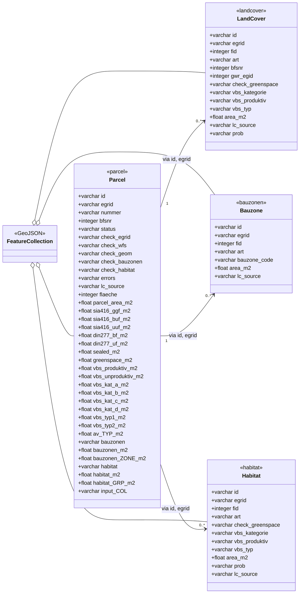

# Data Model — Inputs & Outputs

What goes in, what comes out. For *how* each land cover type is classified, see
**[CLASSIFICATION.md](CLASSIFICATION.md)**; for *how* the processing works, see
**[ARCHITECTURE.md](ARCHITECTURE.md)**.

All geometry is in **EPSG:2056** (CH1903+ / LV95). Outputs are alphanumeric only —
no geometry column is exported (it is used internally for clipping and area
calculation, then dropped).

---

## Modes of operation

### Mode 1 — User-provided parcel list
You provide a CSV/Excel file with at minimum `ID` and `EGRID`. Extra columns are
preserved and carried through to all outputs, prefixed `input_`. EGRIDs not found
in the AV data still appear in the Parcels output with an error in `check_egrid`.

### Mode 2 — Full survey processing
All parcels from the official survey GeoPackage (`resf` table) are processed; no
user input file is needed. (Python CLI only.)

---

## Input — User parcel list (Mode 1)

| Attribute | Format | Required | Description |
|-----------|--------|----------|-------------|
| `ID` | `varchar` | Yes | User-defined feature identifier |
| `EGRID` | `varchar(14)` | Yes | Federal parcel identifier — foreign key to the AV data (e.g. `CH427760110057`) |
| *(other columns)* | *(varies)* | No | Passed through to all outputs, prefixed `input_` (e.g. `Address` → `input_Address`) |

## Input — Official survey GeoPackage (AV)

**Source:** `av_2056.gpkg` — EPSG:2056. Download: https://www.geodienste.ch/services/av
(The web app fetches the equivalent data live from swisstopo + the geodienste.ch WFS instead.)

### Table `resf` — Parcels (Liegenschaften and SDR)

Contains both *Liegenschaften* (real property) and *selbständige und dauernde
Rechte* (SDR / independent permanent rights, e.g. Baurecht). Both carry an EGRID
and are processed uniformly.

| Attribute | Format | Description |
|-----------|--------|-------------|
| `fid` | `integer` | Internal GeoPackage feature ID |
| `EGRIS_EGRID` | `varchar(14)` | Federal parcel identifier |
| `Nummer` | `varchar` | Official parcel number |
| `NBIdent` | `varchar` | Surveying office identifier |
| `BFSNr` | `integer` | Federal municipality number |
| `Flaechenmass` | `integer` | Legal area in m² (may be missing; may differ from the calculated area — see note below) |
| `GWR_EGID` | `integer` | Federal building register ID (optional) |
| `geom` | `MULTIPOLYGON` | Parcel polygon geometry (used internally, not exported) |

### Table `lcsf` — Land cover surfaces (Bodenabdeckung)

| Attribute | Format | Description |
|-----------|--------|-------------|
| `fid` | `integer` | Internal GeoPackage feature ID |
| `Art` | `varchar` | Land cover type (BBArt domain — see [CLASSIFICATION.md](CLASSIFICATION.md)) |
| `BFSNr` | `integer` | Federal municipality number |
| `GWR_EGID` | `integer` | Federal building register ID (optional) |
| `geom` | `MULTIPOLYGON` | Land cover polygon geometry (used internally, not exported) |

> **Official vs. calculated area.** `Flaechenmass` is the *legal* area and may
> differ from the computed polygon area due to projection reductions or rounding
> (VAV Art. 16). Small discrepancies (sub-m² for small parcels, a few m² for large
> ones) are normal. The calculated `parcel_area_m2` is for QA comparison and as a
> fallback when `Flaechenmass` is missing.
>
> **Duplicate EGRIDs.** A single EGRID can map to multiple `fid` entries (ongoing
> mutations, overlapping SDR/Baurecht). All matching geometries are dissolved into
> one polygon per EGRID; this is flagged in `check_egrid`.

---

## Output — overview (UML)

The four output layers and how they relate. One **Parcel** carries the aggregated
columns; each detail layer is one row per clipped piece, joined back to its parcel
by `id` + `egrid`. The web app packs all four into one GeoJSON `FeatureCollection`
(each feature tagged with its `layer`); the CSV/XLSX export writes one file/sheet
per layer.

**Reading the diagram**

- The `«…»` stereotype is the GeoJSON `layer` value (`parcel` / `landcover` / `bauzonen` / `habitat`).
- **Placeholder column families** on `Parcel` (each is *many* real columns, named at runtime):
  - `av_TYP_m2` → `av_<bbart>_m2` — **26**, one per AV land-cover type (e.g. `av_gebaeude_m2`).
  - `bauzonen_ZONE_m2` → `bauzonen_<slug>_m2` — one per ARE zone present (opt-in).
  - `habitat_GRP_m2` → `habitat_<slug>_m2` — **9** TypoCH level-1 groups (opt-in).
  - `input_COL` → `input_<name>` — passthrough user columns.
- **Bauzone** and **Habitat** layers are **opt-in** (on by default in the web app).
- Full per-column detail is in the per-layer tables below.

---

## Output — Parcels (`{input}_parcels_{timestamp}.csv`)

One row per parcel. Exported by default (Python: disable with `--no-parcels`).
Aggregation columns are included by default (Python: `--no-aggregate` to omit).

> **Field-id convention (web app + Python CLI).** All output column ids are
> lowercase `snake_case`, namespaced by classification scheme (`sia416_`, `din277_`,
> `vbs_`) or source layer (`av_` AV land cover, `bauzonen_` ARE zones, `habitat_`
> BAFU). Coded *values* keep their domain casing (e.g. `lc_source` = `AV`, the `art`
> value = `Gebaeude`). The web app's `status` / `errors` / `check_wfs` / `check_geom`
> / `lc_source` columns are web-only; the Python `check_egrid` carries a message
> (`EGRID found in AV`) rather than the web app's short code.

| Attribute | Format | Description |
|-----------|--------|-------------|
| `id` | `varchar` | User-defined identifier (Mode 1) or generated from AV (Mode 2) |
| `egrid` | `varchar(14)` | Federal parcel identifier |
| `nummer` | `varchar` | Official parcel number from AV |
| `bfsnr` | `integer` | Federal municipality number |
| `status` | `varchar` | Parcel resolution — `found` / `not_found` |
| `check_egrid` | `varchar` | EGRID-resolution detail — `found` / `merged` / `not_found` / `invalid` / `error:<msg>` (see enum below) |
| `check_wfs`, `check_geom` | `varchar` | Land-cover retrieval / clipping status (see enums below). Web app only |
| `check_bauzonen`, `check_habitat` | `varchar` | Overlay retrieval status; present when that overlay ran. Web app only |
| `errors` | `varchar` | Error message(s) for the parcel; empty when none |
| `lc_source` | `varchar` | Land-cover source — `AV` for resolved parcels, **empty** when the parcel has no land cover. The Bauzonen / BAFU overlays are **separate** layers, not the parcel's source |
| `flaeche` | `integer` | Legal area from AV (may be missing) |
| `parcel_area_m2` | `float` | Calculated 2D planar area of the cleaned parcel polygon |
| `sia416_ggf_m2` | `float` | Building footprint area (SIA 416 GGF) |
| `sia416_buf_m2` | `float` | Developed surrounding area (SIA 416 BUF) |
| `sia416_uuf_m2` | `float` | Undeveloped surrounding area (SIA 416 UUF) |
| `din277_bf_m2` | `float` | Built-up area — buildings (DIN 277 BF) |
| `din277_uf_m2` | `float` | Non-built-up area — everything else (DIN 277 UF) |
| `sealed_m2` | `float` | Sealed area (Gebäude + all *befestigt*) |
| `greenspace_m2` | `float` | Total green space (soil-covered + wooded) |
| `vbs_produktiv_m2`, `vbs_unproduktiv_m2` | `float` | Biologically productive / unproductive area (VBS) |
| `vbs_kat_a_m2` … `vbs_kat_d_m2` | `float` | Area per VBS Kategorie (A. Siedlung, B. Landwirtschaft, C. bestockt, D. unproduktiv) |
| `vbs_typ1_m2`, `vbs_typ2_m2` | `float` | Area per VBS Typ — biologically productive only |
| `av_{art}_m2` | `float` | Area per AV land-cover type: `av_` + the lowercased BBArt value + `_m2` (e.g. `av_gebaeude_m2`, `av_strasse_weg_m2`, `av_acker_wiese_weide_m2`). The CSV has all 26 types as columns (0 where absent); the **GeoJSON is sparse** — each parcel carries only the types it contains (area > 0). AV parcels only |
| `bauzonen`, `bauzonen_m2` | `varchar` | Building-zone names + areas intersecting the parcel, semicolon-joined (opt-in) |
| `bauzonen_{slug}_m2` | `float` | One column per building-zone type: `bauzonen_` + the slugified (lowercase) zone name (e.g. `bauzonen_wohnzonen_m2`, `bauzonen_zonen_fuer_oeffentliche_nutzungen_m2`); 0 where the zone is absent. A parcel can span several zones (opt-in) |
| `habitat`, `habitat_m2` | `varchar` | BAFU habitat group names + areas intersecting the parcel, semicolon-joined, grouped by **TypoCH level-1** (opt-in) |
| `habitat_{slug}_m2` | `float` | One column per TypoCH level-1 habitat group: `habitat_` + the slugified (lowercase) group name (e.g. `habitat_waelder_m2`, `habitat_gruenland_m2`, `habitat_gebaeude_anlagen_m2`); 0 where absent. 9 groups (opt-in) |
| `input_*` | *(varies)* | User-provided columns, prefixed `input_` (Mode 1) |

> The sum of `sia416_ggf_m2 + sia416_buf_m2 + sia416_uuf_m2` (= the classified
> land cover) is typically **less than** `parcel_area_m2`: AV land cover only covers
> the mapped portion of each parcel, so the remainder is parcel area without land
> cover. The per-type `av_*_m2` columns sum to the same classified total.

---

## Output — Land Cover (`{input}_landcover_{timestamp}.csv`)

One row per clipped land cover piece per parcel. Exported by default (Python:
disable with `--no-landcover`).

| Attribute | Format | Description |
|-----------|--------|-------------|
| `id` | `varchar` | Parcel identifier (same as Parcels output) |
| `egrid` | `varchar(14)` | Parcel identifier (links to Parcels output) |
| `fid` | `integer` | Land cover feature ID from AV |
| `art` | `varchar` | Land cover type — BBArt value ([CLASSIFICATION.md](CLASSIFICATION.md)) |
| `bfsnr` | `integer` | Federal municipality number |
| `gwr_egid` | `integer` | Federal building register ID (may be empty) |
| `check_greenspace` | `varchar` | `Green space (soil-covered)` / `Green space (wooded)` / `Not green space` |
| `vbs_kategorie` | `varchar` | `A. Settlement area` / `B. Agricultural area` / `C. Wooded area` / `D. Unproductive area` |
| `vbs_produktiv` | `varchar` | `1 Biologically productive` / `2 Biologically unproductive` |
| `vbs_typ` | `varchar` | `Type 1 - …` / `Type 2 - …`; **blank** for biologically unproductive types |
| `area_m2` | `float` | Calculated 2D planar area of the clipped land cover polygon |
| `lc_source` | `varchar` | `AV` (Amtliche Vermessung) in this layer |
| `prob` | `varchar` | Empty for AV rows (populated only in the Habitat layer) |

> **Column values are stable English codes**, translated for display in the web app
> and written verbatim to CSV/Excel. See [CLASSIFICATION.md](CLASSIFICATION.md) for the
> rules behind the `check_greenspace` / `vbs_*` values. (The Python `--bauzonen` /
> `--habitat` CLI flags attach overlay columns to green-space rows here; the **web app**
> emits Bauzonen and Habitat as their own layers instead — see below.)

---

## Output — Bauzonen (overlay detail · web app, opt-in)

One row per clipped building-zone piece per parcel — Excel sheet **Bauzonen**,
GeoJSON `layer: bauzonen`. Source: ARE harmonised building zones
(`ch.are.bauzonen`). On by default in the web app.

| Attribute | Format | Description |
|-----------|--------|-------------|
| `id`, `egrid` | `varchar` | Parcel identifier (links to Parcels) |
| `fid` | `integer` | Zone feature id |
| `art` | `varchar` | Zone name / Hauptnutzung (e.g. `Wohnzonen`) — the generic "type" field shared by all overlay layers |
| `bauzone_code` | `varchar` | Harmonised use code `ch_code_hn` (e.g. `11` = Wohnzonen) |
| `area_m2` | `float` | Clipped zone area within the parcel |
| `lc_source` | `varchar` | `Bauzonen` |

---

## Output — Habitat (overlay detail · web app, opt-in)

One row per clipped BAFU habitat piece per parcel — Excel sheet **Lebensräume**,
GeoJSON `layer: habitat`. Source: BAFU Lebensraumkarte
(`ch.bafu.lebensraumkarte-schweiz`) — a **modeled, probabilistic** map, not an
official survey. SIA 416 / DIN 277 / sealed are not derivable here; only green
space + VBS are classified (provisional).

| Attribute | Format | Description |
|-----------|--------|-------------|
| `id`, `egrid` | `varchar` | Parcel identifier (links to Parcels) |
| `fid` | `integer` | Habitat feature id |
| `art` | `varchar` | TypoCH habitat label (e.g. `6.3.1 Buchenwald`) |
| `check_greenspace` | `varchar` | Green-space class (derived) |
| `vbs_kategorie`, `vbs_produktiv`, `vbs_typ` | `varchar` | VBS classification (provisional for a modeled map) |
| `area_m2` | `float` | Clipped habitat area within the parcel |
| `prob` | `varchar` | BAFU model probability (`prob_de`) |
| `lc_source` | `varchar` | `BAFU` |

---

## Output — GeoJSON (combined · web app)

The web app also exports **all layers in one** GeoJSON `FeatureCollection`. Every
feature carries a `layer` property — `parcel` | `landcover` | `bauzonen` |
`habitat` — so the four feature types are distinguishable (`lc_source` alone
can't: a parcel and its AV land-cover pieces both report `AV`). Parcels keep a
`null` geometry when the EGRID isn't found, so the file is a complete record of
every input parcel. Field ids and values match the per-layer tables above.

---

## Enumerations (coded values)

Columns whose values come from a fixed set. **Code** = the value written verbatim
to the output; **EN** / **DE** = the labels the web app shows for it.

### `check_egrid` (Parcels)

| Code | EN | DE | Description |
|------|----|----|-------------|
| `found` | Found | Gefunden | Single matching parcel found. The Python CLI writes the message `EGRID found in AV`. |
| `merged` | Found (merged) | Gefunden (zusammengeführt) | Multiple `fid` entries dissolved into one. Python: `EGRID found in AV (N entries merged)`. |
| `not_found` | Not found | Nicht gefunden | EGRID not found in the AV data. Python: `EGRID missing or not in AV`. |
| `invalid` | Invalid EGRID | EGRID ungültig | Malformed EGRID (does not start with `CH`). Web app only. |
| `error:<msg>` | Error: \<msg\> | Fehler: \<msg\> | Unexpected processing error, message appended. Web app only. |

### `check_wfs` (Parcels — web app only)

| Code | EN | DE | Description |
|------|----|----|-------------|
| `ok` | OK | OK | Land cover retrieved successfully |
| `truncated` | Truncated | Abgeschnitten | WFS hit the feature cap (1000); the result may be incomplete |
| `wfs_error` | WFS error | WFS-Fehler | WFS request failed after retries; no land cover for this parcel |

### `check_geom` (Parcels — web app only)

| Code | EN | DE | Description |
|------|----|----|-------------|
| `ok` | OK | OK | All land cover features clipped successfully |
| `N_skipped` | N skipped | N übersprungen | N features could not be clipped (invalid geometry) and were dropped |

### `check_bauzonen` / `check_habitat` (Parcels — web app only)

Present when the matching overlay was analysed (both on by default in the web app).

| Code | EN | DE | Description |
|------|----|----|-------------|
| `ok` | OK | OK | Overlay features retrieved and clipped |
| `truncated` | Truncated | Abgeschnitten | Identify hit the per-bbox feature cap (200); the result may be incomplete |
| `error` | Error | Fehler | Identify request failed; no overlay data for this parcel |

### `lc_source` (Parcels & Land Cover — web app only)

| Code | EN | DE | Description |
|------|----|----|-------------|
| `AV` | AV | AV | Amtliche Vermessung land cover (authoritative cadastral surface) |
| `BAFU` | BAFU | BAFU | BAFU Lebensraumkarte (modeled habitat) — the web app's optional **habitat overlay layer** (not an AV fallback). Only green space + VBS derived; SIA 416 / DIN 277 / sealed blank. See [CLASSIFICATION.md](CLASSIFICATION.md) §BAFU Lebensraumkarte |
| `Bauzonen` | Bauzonen | Bauzonen | Harmonised building zones (`ch.are.bauzonen`) — the web app's optional **building-zone overlay layer**; `art` holds the zone name |

### `check_greenspace` (Land Cover)

| Code | EN | DE | Description |
|------|----|----|-------------|
| `Green space (soil-covered)` | Soil-covered | Humusiert | Humusiert green space: Acker/Wiese/Weide, Reben, Gartenanlage, Hoch-/Flachmoor, übrige humusierte, Wytweide |
| `Green space (wooded)` | Wooded | Bestockt | Bestockt green space: geschlossener Wald, übrige bestockte |
| `Not green space` | Not vegetated | Nicht begrünt | All other types (incl. übrige Intensivkultur, befestigt, Gewässer, vegetationslos, Gebäude) |

### `vbs_kategorie` (Land Cover)

| Code | EN | DE | Description |
|------|----|----|-------------|
| `A. Settlement area` | A. Settlement area | A. Siedlungsfläche | Buildings, all *befestigt* surfaces, and Abbau/Deponie |
| `B. Agricultural area` | B. Agricultural area | B. Landwirtschaftsfläche | *Humusiert* agricultural surfaces incl. Wytweide |
| `C. Wooded area` | C. Wooded area | C. Bestockte Fläche | Forest: geschlossener Wald, übrige bestockte |
| `D. Unproductive area` | D. Unproductive area | D. Unproduktive Fläche | Water, bog, reed, rock, glacier, scree, other unvegetated |

### `vbs_produktiv` (Land Cover)

| Code | EN | DE | Description |
|------|----|----|-------------|
| `1 Biologically productive` | 1 Biologically productive | 1 Biologisch produktiv | Kategorie B + C + D, **minus** Fels, Gletscher/Firn, Geröll/Sand |
| `2 Biologically unproductive` | 2 Biologically unproductive | 2 Biologisch unproduktiv | Kategorie A, **plus** Fels, Gletscher/Firn, Geröll/Sand |

### `vbs_typ` (Land Cover)

| Code | EN | DE | Description |
|------|----|----|-------------|
| `Type 1 - Green spaces near buildings` | Type 1 — Green spaces near buildings | Typ 1 — Grünflächen in Gebäudeumgebung | Gartenanlage only |
| `Type 2 - Other green spaces` | Type 2 — Other green spaces | Typ 2 — Übrige Grünflächen | All other biologically productive types |
| *(blank)* | — | — | Biologically unproductive types have no Typ |

### `Art` (lcsf input / Land Cover output)

One of the 26 BBArt values (AV enum order 0–25). See the master table in
**[CLASSIFICATION.md](CLASSIFICATION.md)** for each value's code, EN, DE, and all
classification mappings.
