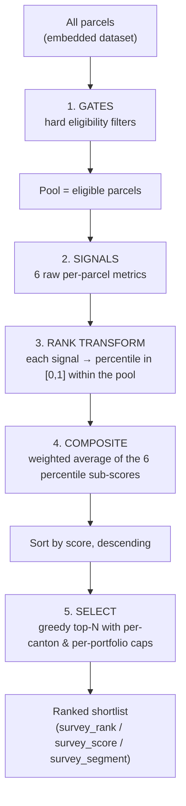

# Survey Prioritisation — Implemented Method & Sampling Properties

Reference for the dashboard's **Priorisierung** tab: exactly how the current code
turns the parcel dataset into a ranked shortlist of survey candidates, what every
slider does, and — for readers evaluating it as a **sampling method** — the precise
statistical nature and limits of the procedure.

- **Purpose** — an operational triage: which federal parcels are most worth sending a
  [Natur & Wirtschaft](https://www.naturundwirtschaft.ch/) field expert to survey. It is a
  judgment-driven *ranking*, deliberately **not** a probability sample (see [§0](#0-what-this-is--and-is-not-read-first)).
- **Implementation** (this document): the algorithm as coded, function-by-function.
- **Code**: all logic is in one file, [`dashboard/js/dashboard.js`](../dashboard/js/dashboard.js),
  functions `prioGate` / `prioMetrics` / `pctRanks` / `prioBase` / `computePrio`
  (search those names). No server, no hidden state — everything runs in the browser
  on the embedded parcel data.

---

## 0. What this is — and is not (read first)

> **This is a deterministic, purposive *ranking* (a multi-criteria decision index),
> not a probability sample.** There is no randomisation anywhere in the procedure.
> Given the input file and the control settings, every parcel's inclusion is a fixed
> function of its own attributes and the attributes of the other parcels in the pool.
> First-order inclusion probabilities are degenerate (0 or 1), so **design-based
> inference does not apply**: you cannot form Horvitz–Thompson estimators, sampling
> variances, or design-unbiased population totals/means from the selected set.

The **estimand is operational, not inferential**: "the set of parcels most worth a
field visit under the current criteria and weights." It is explicitly a triage —
*where to send the expert* — and not an estimate of any population quantity, nor a
prediction of certification. If probability-based inference about the federal
portfolio is the goal, see [§10](#10-if-you-need-design-based-inference).

Everything below is **fully reproducible**: same input + same settings → byte-identical
output ([§8](#8-determinism--reproducibility)).

---

## 1. Pipeline at a glance



Two-stage dependency (matters for interpretation and for reading the code):

| Changing… | …recomputes | Code |
|---|---|---|
| a **gate** (federal, real-parcel, UF, Bauzone-share) | the whole pool **and all percentile ranks** | `prioBase()` re-runs (cache keyed on the gate signature `[federal, sap, ufMin, bauzone, bzMin]`) |
| a **weight / Top-N / cap** | only the composite + selection (pool & percentiles unchanged) | `computePrio()` re-runs; `prioBase()` returns cached |

So the six standardised signals are **fixed while you explore weightings** — convenient
for weight sensitivity analysis — but they **shift whenever a gate moves**, because the
percentiles are relative to the pool ([§9](#9-statistical-caveats--scope-of-valid-use)).

---

## 2. Step 1 — Eligibility gates (define the pool)

The pool is every parcel that passes **all** active gates (`prioGate`). Each gate is
independently toggled/tuned in the UI. Order of evaluation does not matter (logical AND).

| Gate | Rule (as coded) | Control | Default |
|---|---|---|---|
| **Federal ownership** | `input_eigent.art === "1"` | checkbox `pr-federal` | on |
| **Real parcel** | Bezeichnung does **not** match the SAP pseudo-parcel prefixes `ABGA*` / `LÖVM*` / `PP` (`EXCLUDE_RULES`) | checkbox `pr-sap` | on |
| **Minimum surroundings** | `UF = sia416_buf_m2 + sia416_uuf_m2 ≥ ufMin` | slider `pr-uf` (0–5000 m², step 100) | 1000 m² |
| **Inside a building zone** | `bzSum / parcel_area_m2 ≥ bzMin/100`, where `bzSum` = Σ of the harmonised building-zone areas **excluding** the "Ohne Bauzone" remainder | checkbox `pr-bauzone` + slider `pr-bz` (0–100 %, step 5) | ≥ 50 % |

Notes for the record:
- `UF` (*Umgebungsfläche*) is SIA 416 BUF + UUF, i.e. the parcel minus the building
  footprint. It is also the quantity in the minimum-surroundings gate.
- A parcel with a missing/blank `input_eigent.art` fails the federal gate (string
  compare to `"1"`). A parcel with `parcel_area_m2 = 0` fails the Bauzone gate.
- The Bauzone gate uses building-zone **coverage share**, not adjacency.

Actual code — `prioGate` / `prioUF` (`prio.federal`, `prio.ufMin`, … are the live
control values from §7):

```js
function prioUF(p) { return num(p.sia416_buf_m2) + num(p.sia416_uuf_m2); }

function prioGate(p) {
  if (prio.federal && String(p["input_eigent.art"]) !== "1") return false;
  if (prio.sap && EXCLUDE_RULES.some(function (r) { return nameMatches(p, r); })) return false;
  if (prioUF(p) < prio.ufMin) return false;
  if (prio.bauzone) {
    var area = num(p.parcel_area_m2), bz = parcelStats(p).bzSum;
    if (!area || bz / area < prio.bzMin / 100) return false;
  }
  return true;
}
```

The **left-hand side filters of the Übersicht tab do not affect this tab** — the
Priorisierung pool is derived directly from the full embedded dataset via the gates
above, independently.

---

## 3. Step 2 — Per-parcel signals (raw metrics)

For each parcel in the pool, `prioMetrics` computes six raw signals from the parcel's
columns (areas in m²). `parcelStats` supplies the per-parcel sums used below.

| # | Signal | Raw value (as coded) | Source |
|---|---|---|---|
| 1 | **Green surroundings** | two sub-signals: `greenShare = min(1, greenspace_m2 / UF)` (0 if UF=0) **and** `green_abs = greenspace_m2` | `greenspace_m2` (humusiert + bestockt), `UF` |
| 2 | **Scale** | `UF` (see rank note in §4) | `sia416_buf_m2 + sia416_uuf_m2` |
| 3 | **Urban relevance** | `PRIO_BZ_REL[dominant zone slug]`, else `0` | dominant building zone = the zone type with the largest area on the parcel (`bzDomSlug`) |
| 4 | **Habitat naturalness** | `natShare = hbNat / hbAll` if `hbAll>0`, else treated as **missing** | `hbNat` = Σ BAFU habitat area in TypoCH level-1 classes **1–7** (near-natural); `hbAll` = Σ all mapped habitat area |
| 5 | **Structural diversity** | `max(nLc, nHb)` | `nLc` = # distinct AV land-cover types present (`av_*_m2 > 0`); `nHb` = # distinct habitat types present |
| 6 | **Data quality** | `q = base − penalties`, floored at 0 | `base = 1` if `lc_source = AV` else `0.6`; `−0.3` if no classified cover; `−0.2` if `check_geom ≠ ok`; `−0.2` if `check_wfs ≠ ok` |

The **urban relevance lookup** `PRIO_BZ_REL` (expert-set, N&W favours developed
grounds) — the only distinct values signal 3 can take besides 0:

| Zone (harmonised) | value | Zone | value |
|---|:--:|---|:--:|
| Arbeitszonen | 1.0 | Wohnzonen | 0.6 |
| Zonen für öffentliche Nutzungen | 1.0 | eingeschränkte Bauzonen | 0.5 |
| Zentrumszonen | 0.9 | weitere Bauzonen | 0.4 |
| Mischzonen | 0.75 | Verkehrszonen innerhalb Bauzonen | 0.3 |
| Tourismus-/Freizeitzonen | 0.7 | *(no building zone)* | 0.0 |

**Near-natural habitat** = TypoCH level-1 classes 1–7; classes 8 (Kulturen) and 9
(Bauten/Anlagen) are excluded (`HABITAT_NAT_DIGIT`).

Actual code — `prioMetrics` (the six raw signals per parcel):

```js
function prioMetrics(p) {
  var area = num(p.parcel_area_m2), uf = prioUF(p), green = num(p.greenspace_m2);
  var st = parcelStats(p), bzDomSlug = st.bzDomSlug, hbNat = st.hbNat, hbAll = st.hbSum, nLc = st.nLc, nHb = st.nHb;
  // Feasibility: authoritative AV cover is best; no land cover at all = little to survey.
  var q = (p.lc_source === "AV" ? 1 : 0.6);
  if (!isCovered(p)) q -= 0.3;
  if (p.check_geom && p.check_geom !== "ok") q -= 0.2;
  if (p.check_wfs && p.check_wfs !== "ok") q -= 0.2;
  return {
    area: area, uf: uf, green: green,
    greenShare: uf ? Math.min(1, green / uf) : 0,          // a share — clamp at 100 %
    urban: (PRIO_BZ_REL[bzDomSlug] || 0),                  // zone-type fit; Bauzone-share is the gate, not the score
    hbAll: hbAll,                                          // total mapped habitat area (0 = BAFU layer not queried for this parcel)
    natShare: hbAll ? hbNat / hbAll : 0,                   // natural share of MAPPED habitat (robust to partial coverage)
    diversity: Math.max(nLc, nHb),                         // max, not sum — don't double-weight parcels that have both layers
    quality: Math.max(0, q)
  };
}
```

…and `parcelStats`, which produces the per-parcel sums it reads (`bzSum` excludes the
"Ohne Bauzone" remainder; `hbNat` sums only near-natural TypoCH classes; `nLc`/`nHb`
count distinct present types):

```js
function parcelStats(p) {
  var s = _statsCache.get(p); if (s) return s;
  var bzSum = 0, bzSumAll = 0, hbSum = 0, hbNat = 0, nLc = 0, nHb = 0, bzDom = 0, bzDomSlug = "";
  for (var k in p) {
    if (!Object.prototype.hasOwnProperty.call(p, k) || k.slice(-3) !== "_m2") continue;
    var v = num(p[k]);
    var bm = BAUZONE_RE.exec(k);
    if (bm) { bzSumAll += v; if (bm[1] !== "ohne_bauzone") { bzSum += v; if (v > bzDom) { bzDom = v; bzDomSlug = bm[1]; } } continue; }
    var hm = HABITAT_RE.exec(k);
    if (hm) { hbSum += v; if (v > 0) nHb++; if (HABITAT_NAT_DIGIT[habDigit(hm[1])]) hbNat += v; continue; }
    if (k.indexOf("av_") === 0) { if (v > 0) nLc++; }
  }
  s = { bzSum: bzSum, bzSumAll: bzSumAll, hbSum: hbSum, hbNat: hbNat, nLc: nLc, nHb: nHb, bzDom: bzDom, bzDomSlug: bzDomSlug };
  _statsCache.set(p, s); return s;
}
```

---

## 4. Step 3 — Rank (percentile) transform

Each raw signal is converted to a **within-pool percentile rank in [0, 1]** by
`pctRanks`. This is a non-parametric standardisation (robust to scale and outliers)
that makes the six heterogeneous signals combinable.

For a signal vector of length *n* (n = pool size):
1. Sort values ascending.
2. A value occupying sorted 0-indexed positions *i…j* (a tie group) receives
   `((i + j) / 2) / (n − 1)` — the **average (mid-)rank**, normalised so the
   minimum → 0 and the maximum → 1.
3. If *n ≤ 1*, every value gets 0.5 (no percentile context).

Equivalently: `score = (average 1-based rank − 1) / (n − 1)`, mid-ranks for ties.

Applied per signal (`prioBase`):

| Sub-score | Definition |
|---|---|
| `sc.green` | `0.6 · pctRanks(greenShare) + 0.4 · pctRanks(green_abs)` — a blend of the share and the absolute-area percentiles (`prioBlend`) |
| `sc.scale` | `pctRanks(log(1 + UF))` |
| `sc.urban` | `pctRanks(urban)` |
| `sc.habitat` | `pctRanksDefined(natShare if hbAll>0 else null)` |
| `sc.diversity` | `pctRanks(max(nLc, nHb))` |
| `sc.quality` | `pctRanks(quality)` |

Three properties a reviewer should note:

- **The `log(1 + UF)` in `sc.scale` is inert.** Percentile rank is invariant under any
  strictly monotone transform, and `log(1+·)` is strictly increasing on `UF ≥ 0`, so
  `pctRanks(log(1+UF)) ≡ pctRanks(UF)` element-wise. The log changes nothing in the
  result; it is documented here only so the code isn't misread as applying a cardinal
  log-scaling.
- **Missing habitat data is neutral, not penalised.** `pctRanksDefined` ranks only the
  parcels that actually have mapped habitat (`hbAll>0`) among themselves, and assigns
  the neutral **0.5** to parcels with no habitat data — so absence of BAFU coverage
  neither helps nor hurts a parcel's habitat sub-score. (The other five signals treat
  their "missing" as the raw value 0, i.e. a low rank — an **asymmetry** worth knowing.)
- **Signals 3, 5, 6 are coarse/discrete.** Urban (≤10 distinct values), diversity
  (small integer counts) and quality (a handful of discrete penalty combinations)
  produce heavily tied percentiles that take few distinct levels. Green-share and scale
  are effectively continuous. So the composite's fine gradient is driven mainly by the
  continuous signals; the discrete ones contribute step-like shifts.

Actual code — `pctRanks` (mid-rank percentile), `pctRanksDefined` (neutral 0.5 for
missing), and the per-signal ranking in `prioBase`:

```js
// Percentile rank in [0,1] within the pool, using midrank for ties so identical
// values always get the same score (no spurious gradient from array order).
function pctRanks(vals) {
  var n = vals.length;
  if (n <= 1) return vals.map(function () { return 0.5; }); // a lone candidate has no percentile context
  var idx = vals.map(function (v, i) { return i; }).sort(function (a, b) { return vals[a] - vals[b]; });
  var r = new Array(n), i = 0;
  while (i < n) { var j = i; while (j + 1 < n && vals[idx[j + 1]] === vals[idx[i]]) j++; var mid = ((i + j) / 2) / (n - 1); for (var k = i; k <= j; k++) r[idx[k]] = mid; i = j + 1; }
  return r;
}

// null/undefined/non-finite values (e.g. parcels with no habitat data) are excluded
// from the ranking and scored neutrally (0.5).
function pctRanksDefined(vals) {
  var pos = [], defined = [];
  vals.forEach(function (v, i) { if (v != null && isFinite(v)) { pos.push(i); defined.push(v); } });
  var r = []; for (var i = 0; i < vals.length; i++) r[i] = 0.5;
  var dr = pctRanks(defined); pos.forEach(function (origI, k) { r[origI] = dr[k]; });
  return r;
}

function prioBlend(a, b, wa) { return a.map(function (v, i) { return wa * v + (1 - wa) * b[i]; }); }

function prioBase() {
  var sig = [prio.federal, prio.sap, prio.ufMin, prio.bauzone, prio.bzMin].join("|");
  if (_prioBase && _prioSig === sig) return _prioBase;      // cache: pool + ranks change only when a GATE changes
  var pool = PARCELS.filter(prioGate);
  var M = pool.map(prioMetrics);
  var sc = {
    green: prioBlend(pctRanks(M.map(function (m) { return m.greenShare; })), pctRanks(M.map(function (m) { return m.green; })), 0.6),
    scale: pctRanks(M.map(function (m) { return Math.log(1 + m.uf); })),
    urban: pctRanks(M.map(function (m) { return m.urban; })),
    habitat: pctRanksDefined(M.map(function (m) { return m.hbAll > 0 ? m.natShare : null; })),
    diversity: pctRanks(M.map(function (m) { return m.diversity; })),
    quality: pctRanks(M.map(function (m) { return m.quality; }))
  };
  _prioSig = sig; _prioBase = { pool: pool, M: M, sc: sc };
  return _prioBase;
}
```

---

## 5. Step 4 — Composite score

`computePrio` combines the six percentile sub-scores into one score per parcel as a
**normalised weighted average**:

```
                Σ_i  w_i · sc_i(p)
score(p)  =  ──────────────────────        i ∈ {green, scale, urban, habitat, diversity, quality}
                    Σ_i  w_i
```

Because every `sc_i ∈ [0, 1]` and `w_i ≥ 0`, `score(p) ∈ [0, 1]`. Only the **ratios**
of the weights matter (the Σ w normalisation), so doubling every weight leaves the
ranking unchanged.

Default weights (each slider 0–40, step 1):

| Signal | Weight `w` | Normalised (default) |
|---|:--:|:--:|
| Grünumgebung (green) | 25 | 0.3125 |
| Grösse / Skala (scale) | 15 | 0.1875 |
| Urbane Relevanz (urban) | 15 | 0.1875 |
| Lebensräume (habitat) | 10 | 0.1250 |
| Strukturvielfalt (diversity) | 5 | 0.0625 |
| Datenqualität (quality) | 10 | 0.1250 |
| **Σ** | **80** | **1.000** |

The composite is a **simple additive weighted-sum model** on rank-transformed
criteria. It does **not** account for correlation between signals: e.g. green and
habitat both proxy naturalness, and scale (UF) and green_abs both grow with parcel
size, so correlated criteria can partially double-count. There is no PCA /
decorrelation / covariance adjustment.

Actual code — the scoring half of `computePrio` (`W` = the weights, `sc` = the six
percentile arrays from `prioBase`):

```js
var W = prio.weights, Wsum = WEIGHT_DEFS.reduce(function (s, w) { return s + (W[w.key] || 0); }, 0) || 1;
var scored = pool.map(function (p, i) {
  return { p: p, m: M[i], score: (W.green * sc.green[i] + W.scale * sc.scale[i] + W.urban * sc.urban[i] + W.habitat * sc.habitat[i] + W.diversity * sc.diversity[i] + W.quality * sc.quality[i]) / Wsum };
});
```

---

## 6. Step 5 — Selection with quota caps

The scored pool is sorted by `score` **descending**, then a **greedy** pass selects up
to `topN` parcels subject to a per-canton and a per-portfolio cap:

```
sort pool by score descending          # ties: stable sort → input-file order
kt = {}; tp = {}; out = []
for parcel in sorted_pool:
    if len(out) == topN: break
    canton    = parcel.input_rg  or "?"
    portfolio = parcel.input_tpf or "?"
    if canton cap enabled    and kt[canton]    >= capN:     continue   # skip, canton full
    if portfolio cap enabled and tp[portfolio] >= tpfCapN:  continue   # skip, portfolio full
    kt[canton] += 1; tp[portfolio] += 1
    out.append(parcel)
rank(parcel) = position in out (1..N)   # score/selection order
```

Actual code — the selection half of `computePrio`:

```js
scored.sort(function (a, b) { return b.score - a.score; });
var out = [], kt = {}, tp = {}, capK = prio.cap ? prio.capN : 0, capT = prio.tpfCap ? prio.tpfCapN : 0;
for (var i = 0; i < scored.length && out.length < prio.topN; i++) {
  var sp = scored[i].p, k = sp.input_rg || "?", t = (sp.input_tpf == null || sp.input_tpf === "") ? "?" : String(sp.input_tpf);
  if (capK && (kt[k] || 0) >= capK) continue;
  if (capT && (tp[t] || 0) >= capT) continue;
  kt[k] = (kt[k] || 0) + 1; tp[t] = (tp[t] || 0) + 1; out.push(scored[i]);
}
out.forEach(function (s, i) { s.rank = i + 1; }); // score-rank, stable across table sorts
```

Consequences a statistician should note:

- **This is not "the top *N* by score."** With caps on, a high-scoring parcel is
  **skipped** if its canton or portfolio quota is already full (filled by even
  higher-scoring parcels). The result is a score-greedy, quota-constrained selection —
  a form of soft stratified spreading applied deterministically in score order.
- **Missing strata share a `"?"` bucket** that is itself capped. If many parcels lack
  `input_rg` or `input_tpf`, that bucket can be truncated at the cap.
- **Tie handling in the sort** is the JS engine's stable sort, so equal scores keep
  their pool order (= input-file order). Deterministic, but the intra-tie order is
  arbitrary (not meaningful).
- **Caps are canton (`input_rg`) and portfolio (`input_tpf`) only.** There is **no
  segment quota and no zone-type quota** in the code (only the canton and portfolio caps
  above) — `survey_segment` is computed and shown but does **not** constrain the
  selection.

**Segment** (descriptive label only, `prioSeg`): from `greenShare` —
`≥ 0.30 → "Grün-reich"`, `≥ 0.15 → "Gemischt"`, else `"Versiegelt"`.

---

## 7. Controls (sliders & toggles) — full reference

| Control | Element | Range · step · default | Sets | Re-derives pool? |
|---|---|---|---|:--:|
| Nur Bund | `pr-federal` (checkbox) | on | federal-ownership gate | **yes** |
| Reale Grundstücke | `pr-sap` (checkbox) | on | SAP pseudo-parcel exclusion gate | **yes** |
| Umgebungsfläche UF ≥ | `pr-uf` (range) | 0–5000 m² · 100 · **1000** | `ufMin` gate threshold | **yes** |
| In Bauzone | `pr-bauzone` (checkbox) | on | enable building-zone-share gate | **yes** |
| Bauzonen-Anteil ≥ | `pr-bz` (range) | 0–100 % · 5 · **50** | `bzMin` gate threshold | **yes** |
| Gewicht Grünumgebung | `prw-green` (range) | 0–40 · 1 · **25** | weight `green` | no |
| Gewicht Grösse / Skala | `prw-scale` | 0–40 · 1 · **15** | weight `scale` | no |
| Gewicht Urbane Relevanz | `prw-urban` | 0–40 · 1 · **15** | weight `urban` | no |
| Gewicht Lebensräume | `prw-habitat` | 0–40 · 1 · **10** | weight `habitat` | no |
| Gewicht Strukturvielfalt | `prw-diversity` | 0–40 · 1 · **5** | weight `diversity` | no |
| Gewicht Datenqualität | `prw-quality` | 0–40 · 1 · **10** | weight `quality` | no |
| Standard (weights) | `pr-reset-w` (button) | — | resets all 6 weights to defaults | no |
| Top-N | `pr-topn` (range) | 10–300 · 10 · **100** | `topN` selection size | no |
| max … pro Kanton | `pr-cap` + `pr-cap-n` | 1–100 · **20** (on) | canton cap `capN` (0 = off) | no |
| max … pro Teilportfolio | `pr-tcap` + `pr-tcap-n` | 1–200 · **30** (on) | portfolio cap `tpfCapN` (0 = off) | no |

Continuous sliders are debounced (~110 ms) before recompute; the value label updates
immediately. "Re-derives pool? = yes" means the six percentile signals are recomputed
(the ranking baseline moves); "no" means only the weighting/selection changes over a
fixed baseline.

---

## 8. Determinism & reproducibility

- **No randomness** — no RNG, no shuffling, no time/date input to the ranking. The
  procedure is a pure function of `(embedded parcels, control settings)`.
- **Caching does not affect results** — `prioBase` memoises the pool + percentiles on
  the gate signature purely for speed; a cold and a warm run give identical output.
- **Ties** in the score sort resolve to input-file order (stable sort) — deterministic
  for a fixed input file.
- **Same file + same slider positions ⇒ identical shortlist, scores (to 4 dp in the
  export) and ranks**, in any browser.

To reproduce a shortlist exactly, record: the input geojson (its content), and all
control values in §7. The shareable Übersicht URL does **not** encode the Priorisierung
controls — capture them separately.

---

## 9. Statistical caveats & scope of valid use

A checklist of properties that bear on any statistical reading of the output:

1. **Not a probability sample.** No randomisation; inclusion probabilities are 0/1.
   No design-based estimation, no sampling variance, no CIs for population quantities.
   The selected set is **not** representative of the federal portfolio and must not be
   used to estimate portfolio characteristics (that would be selection-biased by
   construction — it is the high-priority tail).
2. **Scores are pool-relative, not absolute.** Sub-scores are percentiles **within the
   current gated pool**. Changing any gate re-ranks everything, so a parcel's score can
   move even though its own attributes did not. Scores are not comparable across
   different gate settings or different input files.
3. **The composite is ordinal in spirit.** Rank-transformed inputs mean score
   *differences* are not on a meaningful cardinal scale — a 0.05 gap mid-distribution
   is not equivalent to a 0.05 gap in the tail. Treat the score as an ordering device,
   not a measured quantity.
4. **Weights are expert priors, not fitted.** The default weights, the `PRIO_BZ_REL`
   zone-relevance values, and the near-natural habitat-class set (TypoCH 1–7) are
   judgment calls. They are not estimated from data nor validated against a survey
   outcome; changing them re-orders the selection.
5. **Correlated criteria are not decorrelated.** The additive model can double-count
   overlapping signals (green ↔ habitat; scale ↔ green_abs).
6. **Asymmetric missing-data handling.** Habitat missingness → neutral 0.5; other
   signals' missingness → raw 0 (low rank).
7. **Coarse signals.** Urban / diversity / quality are heavily tied (few distinct
   percentile levels); the fine gradient comes from green and scale.
8. **Greedy quota spreading**, canton + portfolio only, with a capped `"?"` bucket for
   missing strata; no segment/zone quotas (canton + portfolio only).
9. **Inherited data uncertainty.** Inputs carry provenance flags the ranking does not
   remove: synthetic AV land cover where `lc_source = BAFU` / `lc_synthetic = yes`
   (green/sealed **modelled**, not surveyed), BAFU habitat is a modelled ~10 m
   probabilistic map, and areas are geometric approximations (web export uses spherical
   Turf areas). The `quality` signal only *partially* down-weights the weakest of these.
10. **No uncertainty quantification.** There is no standard error, posterior, or
    stability measure on the score or the shortlist. Sensitivity to weights/gates can
    only be explored manually via the sliders.

---

## 10. If you need design-based inference

The current tool is a purposive selector; it is **not** the right instrument if the
goal is unbiased inference about the federal portfolio. A probability-based design over
the same data would instead:

1. Treat the **gated pool as the sampling frame** (or use looser gates).
2. Define **inclusion probabilities** — e.g. stratify by canton / segment, or use the
   priority score as a **size measure** for probability-proportional-to-size (PPS)
   selection.
3. **Randomise** the draw (stratified random / PPS), yielding known, positive inclusion
   probabilities.
4. Estimate population quantities with the corresponding design weights (e.g.
   Horvitz–Thompson) and report design-based variances.

None of steps 2–4 exist in the code today; the composite score could serve as a
stratification or size variable if such a design were built. This is noted as a
possible extension, not a property of the current implementation.

---

## 11. Outputs

`computePrio` produces `prio.selected` (the ranked shortlist). Surfaced as:

- **Rangliste table** — rank, ID, E-GRID, Ort, Kanton, Segment, UF, Grün %, Score.
- **KPIs** — pool size ("Kandidaten"), selection size, total/green area, and the
  **segment mix** bar (descriptive).
- **Canton / portfolio counts** of the selection (spread diagnostics).
- **Map** — the selected parcels.
- **Exports** (`prioRows`, download modal → *Priorisiert* scope): every selected parcel
  with `survey_rank` (1..N), `survey_score` (score to 4 dp), and `survey_segment`, as
  GeoJSON / Excel, plus the A3 PDF *Grundstücksbericht* (one page per parcel).

---

## 12. Code map (for review)

All in [`dashboard/js/dashboard.js`](../dashboard/js/dashboard.js):

| Concern | Symbol |
|---|---|
| Control state + defaults | `prio` object; `WEIGHT_DEFS`; `PRIO_BZ_REL` |
| Eligibility gates | `prioGate`; `EXCLUDE_RULES` (SAP prefixes); `prioUF` |
| Per-parcel raw signals | `prioMetrics`; `parcelStats` (bzSum / bzDomSlug / hbNat / hbSum / nLc / nHb); `HABITAT_NAT_DIGIT` |
| Rank transform | `pctRanks` (mid-rank percentile); `pctRanksDefined` (neutral 0.5 for missing); `prioBlend` |
| Pool + percentile baseline (cached on gate signature) | `prioBase` |
| Composite score + greedy capped selection | `computePrio` |
| Segment label | `prioSeg` |
| Slider/checkbox bindings | the `prBind(...)` block in the Priorisierung init (ids `pr-*`, `prw-*`) |
| Ranked-table render | `renderPriority` / `renderPrioBody` / `PRIO_COLS` |
| Export rows | `prioRows`; `PRIO_XLSX_COLS`; PDF via `generateParcelReport` |

Line numbers drift as the file changes; search by symbol name. The dashboard `index.html`
holds the control markup (ids above) under `#panel-priority`.
