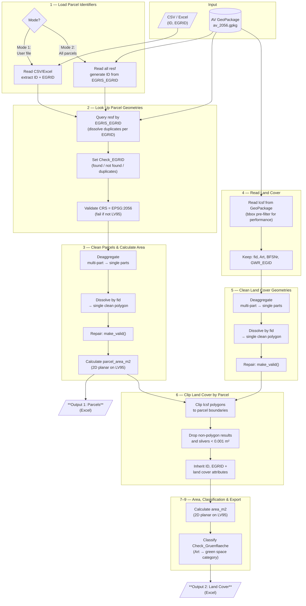

# Landcover Survey - Requirements

## Goal

Aggregate **land cover usage in square meters** for cadastral parcels (Grundstücke) using official Swiss survey data (Amtliche Vermessung).

For each parcel, we clip every intersecting land cover polygon to the parcel boundary, then calculate the 2D planar area (on the LV95 projection) of each clipped piece. This produces a breakdown of how much area (m²) of each land cover type exists within each parcel.

Correct area measurement requires geometry cleanup: official survey data sometimes has multi-part polygons, self-intersections, or slivers. Every geometry (parcel and land cover) must be deaggregated, dissolved by feature ID, and repaired before area calculation.

### Outputs

The tool produces **two alphanumeric output tables** (no geometry exported):

1. **Parcels** — One row per parcel. Contains the parcel identifiers, official and calculated area, and (in Mode 1) any user-provided columns. If a user-provided EGRID cannot be found in the survey data, the row is kept with an error message.

2. **Land Cover** — One row per clipped land cover feature per parcel. Contains the land cover type, clipped area, EGRID, ID, and land cover `fid` for every parcel processed.

---

## Modes of Operation

### Mode 1: User-Provided Parcel List
The user provides a CSV or Excel file containing at minimum:
- `ID` — user-defined feature identifier
- `EGRID` — E-GRID foreign key used to look up the official parcel geometry in the AV data

Additional user columns are preserved and carried through to the Parcels output. If an EGRID is not found in the survey data, the row appears in the Parcels output with an error message (`Check_EGRID`).

### Mode 2: Full Survey Processing
All parcels from the official survey GeoPackage (`resf` table) are processed. No user input file is needed.

---

## Data Quality Note

Official survey polygon data sometimes contains geometry issues (self-intersections, multi-part geometries, slivers). To calculate correct 2D polygon areas, every feature must be:
1. **Deaggregated** — split multi-part geometries into single parts
2. **Dissolved** — merge all parts back into a single clean polygon, grouped by `fid` (official survey feature ID)
3. **Repaired** — fix invalid geometries (using `shapely.make_valid()`, not `buffer(0)` which can collapse narrow polygons)

Only then can reliable 2D polygon area be calculated.

### Official vs. Calculated Area

The official area (`Flaechenmass`) is the *legal* area and may intentionally differ from the computed polygon area. It can include projection reductions or be rounded per legal requirements (VAV Art. 16). Small discrepancies (sub-m² for small parcels, several m² for large ones) are normal and expected. The calculated `area_m2` is the 2D planar area on the LV95 projection — useful for QA comparison, and as a fallback when `Flaechenmass` is missing.

### Duplicate EGRIDs

A single EGRID can map to multiple `fid` entries in `resf` (e.g. during ongoing mutations, or when selbständige und dauernde Rechte / SDR overlap Liegenschaften). When duplicates are found, all matching geometries are dissolved into a single polygon per EGRID before processing continues. This is flagged in `Check_EGRID`.

---

## Data Model

### Input: User Parcel List (Mode 1)

| Attribute | Format | Alias EN | Alias DE | Description EN | Description DE |
|-----------|--------|----------|----------|----------------|----------------|
| `ID` | `varchar` | ID | ID | User-defined feature identifier | Benutzerdefinierte Objektkennung |
| `EGRID` | `varchar(14)` | E-GRID | E-GRID | Federal parcel identifier (foreign key to AV) | Eidgenössischer Grundstücksidentifikator (Fremdschlüssel zu AV) |

Additional columns provided by the user are passed through unchanged to the Parcels output.

### Input: Official Survey GeoPackage (AV)

**Source**: `av_2056.gpkg` — CH1903+ / LV95 (EPSG:2056)
Available at: https://www.geodienste.ch/services/av

#### Table: `resf` — Parcels (Grundstücke: Liegenschaften und SDR)

The `resf` table contains both Liegenschaften (real property) and selbständige und dauernde Rechte (SDR / independent permanent rights, e.g. Baurecht). Both types carry an EGRID and are processed uniformly.

| Attribute | Format | Alias EN | Alias DE | Description EN | Description DE |
|-----------|--------|----------|----------|----------------|----------------|
| `fid` | `integer` | Feature ID | Feature-ID | Internal GeoPackage feature ID | Interne GeoPackage Feature-ID |
| `EGRIS_EGRID` | `varchar(14)` | E-GRID | E-GRID | Federal parcel identifier | Eidgenössischer Grundstücksidentifikator |
| `Nummer` | `varchar` | Parcel Number | Grundstücknummer | Official parcel number | Offizielle Grundstücknummer |
| `NBIdent` | `varchar` | NB Ident | NB-Ident | Surveying office identifier | Nachführungsstellenidentifikator |
| `BFSNr` | `integer` | BFS Number | BFS-Nummer | Federal municipality number | Gemeindenummer des BFS |
| `Flaechenmass` | `integer` | Official Area (m²) | Fläche amtlich (m²) | Legal area in square meters (may be missing; may differ from calculated area — see note above) | Amtliche Fläche in Quadratmetern (kann fehlen; kann von berechneter Fläche abweichen — siehe Hinweis oben) |
| `area_m2` | `float` | **Derived:** Calculated Area (m²) | **Abgeleitet:** Berechnete Fläche (m²) | 2D planar area on LV95 after deaggregate + dissolve + repair | 2D-Planfläche auf LV95 nach Deaggregation + Dissolve + Reparatur |
| `GWR_EGID` | `integer` | GWR Building ID | GWR-Gebäude-ID | Federal building register ID | Eidg. Gebäudeidentifikator |
| `geom` | `MULTIPOLYGON` | Geometry | Geometrie | Parcel polygon geometry (used internally, not exported) | Grundstück-Polygongeometrie (intern verwendet, nicht exportiert) |

#### Table: `lcsf` — Land Cover Surfaces (Bodenabdeckung)

| Attribute | Format | Alias EN | Alias DE | Description EN | Description DE |
|-----------|--------|----------|----------|----------------|----------------|
| `fid` | `integer` | Feature ID | Feature-ID | Internal GeoPackage feature ID | Interne GeoPackage Feature-ID |
| `Art` | `varchar` | Land Cover Type | Bodenabdeckungsart | Type of land cover (BBArt domain) | Art der Bodenabdeckung (BBArt-Domäne) |
| `BFSNr` | `integer` | BFS Number | BFS-Nummer | Federal municipality number | Gemeindenummer des BFS |
| `area_m2` | `float` | **Derived:** Calculated Area (m²) | **Abgeleitet:** Berechnete Fläche (m²) | 2D planar area on LV95 after deaggregate + dissolve + repair | 2D-Planfläche auf LV95 nach Deaggregation + Dissolve + Reparatur |
| `GWR_EGID` | `integer` | GWR Building ID | GWR-Gebäude-ID | Federal building register ID | Eidg. Gebäudeidentifikator |
| `geom` | `MULTIPOLYGON` | Geometry | Geometrie | Land cover polygon geometry (used internally, not exported) | Bodenabdeckung-Polygongeometrie (intern verwendet, nicht exportiert) |

---

## Swiss Land Cover Classification (BBArt)

The land cover types are defined in the Swiss data model **DM.01-AV-CH** (INTERLIS 1, SN 612030) as the `BBArt` domain. This is a **purely Swiss national classification** — it does not follow INSPIRE, ISO, or CORINE/CLC standards. The classification is defined in the technical ordinance on official surveying (TVAV/VAV-VBS, SR 211.432.21), Articles 14–19.

The data model will be replaced by **DMAV** by December 31, 2027.

### Complete Land Cover Type Hierarchy

| AVS Code | Main Category | Sub-category | `Art` Value | Alias DE | Alias EN | SIA 416 | Versiegelt | Grünfläche |
|----------|---------------|--------------|-------------|----------|----------|---------|------------|------------|
| 0 | Gebäude | — | `Gebaeude` | Gebäude | Buildings | GGF | Ja | — |
| 1 | Befestigt | — | `Strasse_Weg` | Strasse, Weg | Road, path | HF | Ja | — |
| 2 | Befestigt | — | `Trottoir` | Trottoir | Sidewalk | HF | Ja | — |
| 3 | Befestigt | — | `Verkehrsinsel` | Verkehrsinsel | Traffic island | HF | Ja | — |
| 4 | Befestigt | — | `Bahn` | Bahn | Railway | HF | Ja | — |
| 5 | Befestigt | — | `Flugplatz` | Flugplatz | Airfield | HF | Ja | — |
| 6 | Befestigt | — | `Wasserbecken` | Wasserbecken | Water basin | HF | Ja | — |
| 7 | Befestigt | — | `uebrige_befestigte` | Übrige befestigte | Other sealed surfaces | HF | Ja | — |
| 8 | Humusiert | — | `Acker_Wiese_Weide` | Acker, Wiese, Weide | Arable land, meadow, pasture | GF | Nein | Humusiert |
| 9 | Humusiert | Intensivkultur | `Reben` | Reben | Vineyards | GF | Nein | Humusiert |
| 10 | Humusiert | Intensivkultur | `uebrige_Intensivkultur` | Übrige Intensivkultur | Other intensive cultivation | GF | Nein | — * |
| 11 | Humusiert | — | `Gartenanlage` | Gartenanlage | Garden area | GF | Nein | Humusiert |
| 12 | Humusiert | — | `Hoch_Flachmoor` | Hoch-/Flachmoor | Raised/flat bog | GF | Nein | Humusiert |
| 13 | Humusiert | — | `uebrige_humusierte` | Übrige humusierte | Other soil-covered | GF | Nein | Humusiert |
| 14 | Gewässer | — | `stehendes` | Stehendes Gewässer | Standing water | WF | Nein | — |
| 15 | Gewässer | — | `fliessendes` | Fliessendes Gewässer | Flowing water | WF | Nein | — |
| 16 | Gewässer | — | `Schilfguertel` | Schilfgürtel | Reed belt | GF | Nein | — |
| 17 | Bestockt | — | `geschlossener_Wald` | Geschlossener Wald | Closed forest | GF | Nein | Bestockt |
| 18 | Bestockt | Wytweide | `Wytweide_dicht` | Wytweide dicht | Dense wooded pasture | GF | Nein | Humusiert ** |
| 19 | Bestockt | Wytweide | `Wytweide_offen` | Wytweide offen | Open wooded pasture | GF | Nein | Humusiert ** |
| 20 | Bestockt | — | `uebrige_bestockte` | Übrige bestockte | Other wooded | GF | Nein | Bestockt |
| 21 | Vegetationslos | — | `Fels` | Fels | Rock | üF | Nein | — |
| 22 | Vegetationslos | — | `Gletscher_Firn` | Gletscher, Firn | Glacier, firn | üF | Nein | — |
| 23 | Vegetationslos | — | `Geroell_Sand` | Geröll, Sand | Scree, sand | üF | Nein | — |
| 24 | Vegetationslos | — | `Abbau_Deponie` | Abbau, Deponie | Extraction, landfill | üF | Nein | — |
| 25 | Vegetationslos | — | `uebrige_vegetationslose` | Übrige vegetationslose | Other unvegetated | üF | Nein | — |

> **SIA 416 Legend:** **GGF** = Gebäudegrundfläche (building footprint — not part of Umgebungsfläche), **HF** = Hartfläche (hard/sealed surface), **GF** = Grünfläche (green/vegetated surface), **WF** = Wasserfläche (water surface), **üF** = übrige Fläche (other surface — natural unvegetated).
> **Versiegelte Fläche** = GGF + HF (all types with Versiegelt = Ja).
>
> **Grünfläche Legend:** **Humusiert** = green space (soil-covered), **Bestockt** = green space (wooded), **—** = keine Grünfläche.
> \* `uebrige_Intensivkultur` is officially "humusiert" but classified as keine Grünfläche — typically managed/sealed horticultural surfaces (orchards, nurseries).
> \*\* `Wytweide_dicht` and `Wytweide_offen` are officially "bestockt" but treated as Humusiert — primarily open pasture with partial tree cover.

### INTERLIS Hierarchy (DM.01-AV-CH)

```
BBArt = (
  Gebaeude,
  befestigt (
    Strasse_Weg, Trottoir, Verkehrsinsel, Bahn,
    Flugplatz, Wasserbecken, uebrige_befestigte),
  humusiert (
    Acker_Wiese_Weide,
    Intensivkultur (Reben, uebrige_Intensivkultur),
    Gartenanlage, Hoch_Flachmoor, uebrige_humusierte),
  Gewaesser (
    stehendes, fliessendes, Schilfguertel),
  bestockt (
    geschlossener_Wald,
    Wytweide (Wytweide_dicht, Wytweide_offen),
    uebrige_bestockte),
  vegetationslos (
    Fels, Gletscher_Firn, Geroell_Sand,
    Abbau_Deponie, uebrige_vegetationslose));
```

### Green Space Classification (Project-Specific)

For this project, land cover types are additionally classified into green space categories.

> **Note:** `Wytweide_dicht` and `Wytweide_offen` are officially classified as "bestockt" (wooded) in the BBArt hierarchy, but are treated as "Humusiert" here because they are primarily open pasture land with partial tree cover — the green/soil surface dominates.
>
> **Note:** `uebrige_Intensivkultur` (orchards, nurseries, allotment gardens) is intentionally classified as "Keine Grünfläche" because these are typically managed/sealed horticultural surfaces, not natural green space.

| Green Space Category | `Art` Values |
|---------------------|-------------|
| Grünfläche (Humusiert) / Green space (Humus) | `Acker_Wiese_Weide`, `Gartenanlage`, `Reben`, `Hoch_Flachmoor`, `uebrige_humusierte`, `Wytweide_dicht`, `Wytweide_offen` |
| Grünfläche (Bestockt) / Green space (Wooded) | `geschlossener_Wald`, `uebrige_bestockte` |
| Keine Grünfläche / Not green space | All others |

---

## Output Tables (Alphanumeric — No Geometry)

### Output 1: Parcels

One row per parcel. In Mode 1, includes user-provided columns and an error message for unresolved EGRIDs.

| Attribute | Format | Alias EN | Alias DE | Description EN | Description DE |
|-----------|--------|----------|----------|----------------|----------------|
| `ID` | `varchar` | ID | ID | User-defined identifier (Mode 1) or generated from AV (Mode 2) | Benutzerdefinierte Kennung (Modus 1) oder aus AV generiert (Modus 2) |
| `EGRID` | `varchar(14)` | E-GRID | E-GRID | Federal parcel identifier | Eidgenössischer Grundstücksidentifikator |
| `Nummer` | `varchar` | Parcel Number | Grundstücknummer | Official parcel number from AV | Offizielle Grundstücknummer aus AV |
| `BFSNr` | `integer` | BFS Number | BFS-Nummer | Federal municipality number | Gemeindenummer des BFS |
| `Check_EGRID` | `varchar` | EGRID Status | EGRID-Status | "EGRID in AV gefunden" if found, error message if not | "EGRID in AV gefunden" falls gefunden, Fehlermeldung falls nicht |
| `Flaechenmass` | `integer` | Official Area (m²) | Fläche amtlich (m²) | Legal area from AV (may be missing) | Amtliche Fläche aus AV (kann fehlen) |
| `parcel_area_m2` | `float` | Parcel Area (m²) | Grundstückfläche (m²) | Calculated 2D planar area of the cleaned parcel polygon | Berechnete 2D-Planfläche des bereinigten Grundstück-Polygons |
| *(user columns)* | *(varies)* | — | — | Additional columns from user input (Mode 1 only) | Zusätzliche Spalten aus Benutzereingabe (nur Modus 1) |

### Output 2: Land Cover

One row per clipped land cover feature per parcel.

| Attribute | Format | Alias EN | Alias DE | Description EN | Description DE |
|-----------|--------|----------|----------|----------------|----------------|
| `ID` | `varchar` | ID | ID | Parcel identifier (same as in Parcels output) | Grundstückskennung (gleich wie in Parzellen-Ausgabe) |
| `EGRID` | `varchar(14)` | E-GRID | E-GRID | Parcel identifier (links to Parcels output) | Grundstücksidentifikator (Verknüpfung zu Parzellen-Ausgabe) |
| `fid` | `integer` | LC Feature ID | BA Feature-ID | Land cover feature ID from AV | Bodenabdeckung Feature-ID aus AV |
| `Art` | `varchar` | Land Cover Type | Bodenabdeckungsart | Type of land cover | Art der Bodenabdeckung |
| `BFSNr` | `integer` | BFS Number | BFS-Nummer | Federal municipality number | Gemeindenummer des BFS |
| `GWR_EGID` | `integer` | GWR Building ID | GWR-Gebäude-ID | Federal building register ID | Eidg. Gebäudeidentifikator |
| `Check_Gruenflaeche` | `varchar` | Green Space Check | Grünfläche-Prüfung | Green space classification based on `Art` | Grünfläche-Klassifizierung basierend auf `Art` |
| `area_m2` | `float` | LC Area (m²) | BA-Fläche (m²) | Calculated 2D planar area of clipped land cover polygon | Berechnete 2D-Planfläche des geschnittenen Bodenabdeckung-Polygons |

---

## Processing Steps



### 1. Load Parcel Identifiers
- **Mode 1**: Read user CSV/Excel → extract `ID` and `EGRID` columns (plus any extra user columns)
- **Mode 2**: Read all features from `resf` table → use `EGRIS_EGRID` as `EGRID`, generate `ID`

### 2. Look Up Parcel Geometries
- Query `resf` table in the GeoPackage by `EGRIS_EGRID`
- Handle duplicate EGRIDs: dissolve all matching geometries into a single polygon per EGRID
- Extract parcel polygon geometries
- Set `Check_EGRID`:
  - `"EGRID in AV gefunden"` — single match found
  - `"EGRID in AV gefunden (n Einträge zusammengeführt)"` — multiple `fid` entries dissolved
  - `"EGRID fehlt oder nicht in AV"` — not found (Mode 1: row kept with error)
- Validate CRS is EPSG:2056 (CH1903+ / LV95) — fail with a clear error if not

### 3. Clean Parcel Geometries & Calculate Area
- Deaggregate multi-part geometries
- Dissolve/merge parts back by `fid` into single clean polygons
- Repair invalid geometries using `make_valid()`
- Calculate 2D planar polygon area on LV95 (`parcel_area_m2`)
- **Write Output 1: Parcels**

### 4. Read Land Cover Surfaces
- Read `lcsf` table from GeoPackage
- Bounding-box pre-filter for performance (this is an optimization only — the actual spatial test is the clip in step 6)
- Keep attributes: `fid`, `Art`, `BFSNr`, `GWR_EGID`

### 5. Clean Land Cover Geometries
- Deaggregate multi-part geometries
- Dissolve/merge parts by `fid` into single clean polygons
- Repair invalid geometries using `make_valid()`
- Note: this produces clean *source* geometries. No further dissolve is done after clipping — each clipped piece is a separate output row.

### 6. Clip Land Cover by Parcel
- Clip land cover polygons to parcel boundaries
- Filter out non-polygon results (linestrings, points) and slivers below 0.001 m² that arise from shared boundary clipping
- Each clip result inherits the parcel's `ID`, `EGRID` and the land cover attributes

### 7. Calculate Clipped Land Cover Area
- Calculate 2D planar area on LV95 of each clipped land cover polygon (`area_m2`)

### 8. Classify Green Space
- Create `Check_Gruenflaeche` based on `Art` value (see classification table above)

### 9. Export Land Cover
- **Write Output 2: Land Cover**

---

## Requirements for Python Implementation

### Core Libraries
- `geopandas` — reading GeoPackage layers, spatial operations (clip, dissolve, area calculation)
- `pandas` — tabular data manipulation, CSV/Excel reading, Excel writing
- `shapely` (>= 2.0) — geometry operations (`make_valid()`, dissolve, intersection)
- `openpyxl` — Excel (.xlsx) input reading

### Input Parameters
- **Mode 1**: Path to user CSV or Excel file (must contain `ID` and `EGRID` columns)
- **Mode 2**: No user file needed (processes all parcels)
- Path to the AV GeoPackage (default: `D:\AV_lv95\av_2056.gpkg`)
- Output directory for the CSV result files

### Performance Considerations
- **Mode 2** processes all parcels in the GeoPackage. Switzerland has ~3.5 million parcels and a corresponding number of land cover features. Loading the entire `lcsf` table into memory may fail on typical machines.
- Consider municipality-level batching (by `BFSNr`) or spatial partitioning for large-scale runs.
- The bbox pre-filter in step 4 significantly reduces the number of land cover features loaded per batch.

### Key Operations
1. Read user input (CSV/Excel) or enumerate all parcels from `resf`
2. Query GeoPackage `resf` table by EGRID, dissolve duplicate EGRIDs, extract parcel geometries
3. Validate CRS is EPSG:2056
4. Deaggregate + dissolve + `make_valid()` parcel geometries by `fid`
5. Calculate parcel 2D planar area
6. Export Parcels output
7. Read `lcsf` layer (bbox pre-filter), keep selected attributes
8. Deaggregate + dissolve + `make_valid()` land cover geometries by `fid`
9. Clip land cover by parcel boundaries, drop non-polygon slivers
10. Calculate clipped land cover 2D planar area
11. Classify green space
12. Export Land Cover output

---

## Python Solution Architecture

### Project Structure

```
landcover-survey/
├── assets/                       # Images for README
├── data/                         # Input CSVs and output results
│   └── test_data.csv              # Sample input (Mode 1)
├── docs/
│   └── REQUIREMENTS.md
├── fme/                          # Original FME workflow (reference only)
│   └── Landcover Survey FME.fmw
├── python/                       # Python scripts (flat, no package)
│   ├── cli.py                    # Entry point: python cli.py (argparse)
│   ├── config.py                 # Constants, BBArt domain, green space mapping, defaults
│   ├── geometry.py               # Geometry cleanup pipeline
│   ├── data_io.py                # Read/write CSV, Excel, GeoPackage layers
│   └── pipeline.py               # Main processing orchestration
├── pyproject.toml                # Project metadata, dependencies
└── LICENSE
```

### Module Responsibilities

#### `cli.py` — Command-Line Interface
Parses arguments and calls the pipeline. Minimal logic — delegates immediately.

```
Arguments:
  --mode {1,2}            Processing mode (default: 1)
  --input PATH            Path to user CSV/Excel (required for Mode 1)
  --gpkg PATH             Path to AV GeoPackage (default: D:\AV_lv95\av_2056.gpkg)
  --output-dir PATH       Output directory (default: ./data)
  --limit N               Limit parcels (Mode 1: first N rows, Mode 2: first N municipalities)
  --verbose, -v           Enable DEBUG logging
```

Logging goes to both console and `<output-dir>/landcover_survey.log`.

#### `config.py` — Constants and Classification
- `GREEN_SPACE: dict[str, str]` — maps each `Art` value to its green space category
- `SIA416: dict[str, str]` — maps each `Art` value to SIA 416 Umgebungsfläche category
- `DEFAULT_GPKG_PATH`, `SLIVER_THRESHOLD` (0.001 m²), `CRS_EPSG` (2056), `COL_FLAECHE`
- No runtime state — pure constants

#### `geometry.py` — Geometry Cleanup Pipeline
Core reusable function applied to both parcel and land cover geometries.

```python
def clean_geometries(gdf: GeoDataFrame, group_col: str) -> GeoDataFrame:
    """Deaggregate multi-part → dissolve by group_col → make_valid().

    Returns a GeoDataFrame with one clean polygon per unique group_col value.
    """

def filter_clip_results(gdf: GeoDataFrame, threshold: float = 0.001) -> GeoDataFrame:
    """Drop non-polygon geometries and slivers below threshold (m²).

    After clipping, shared boundaries can produce LineStrings, Points,
    or GeometryCollections. Extract only Polygon/MultiPolygon parts,
    then drop features with area < threshold.
    """
```

#### `data_io.py` — Input/Output
Handles all file reading and writing. Isolates file format dependencies.

```python
def read_user_input(path: str) -> DataFrame:
    """Read CSV or Excel. Validate ID and EGRID columns exist."""

def read_parcels(gpkg_path: str, egrids: list[str] | None = None) -> GeoDataFrame:
    """Read resf layer. If egrids provided, filter by EGRIS_EGRID (SQL WHERE).
    For Mode 2, reads all features (optionally batched by BFSNr)."""

def read_landcover(gpkg_path: str, bbox: tuple | None = None) -> GeoDataFrame:
    """Read lcsf layer with optional bounding box pre-filter."""

def write_csv(df: DataFrame, path: str) -> None:
    """Write DataFrame to CSV."""
```

#### `pipeline.py` — Main Processing Orchestration
Coordinates the full workflow. Two entry points, one shared core.

```python
def run(mode: int, input_path: str | None, gpkg_path: str, output_dir: str) -> None:
    """Main entry point. Dispatches to Mode 1 or Mode 2, then runs shared pipeline."""

def _load_parcel_identifiers(mode, input_path, gpkg_path) -> DataFrame:
    """Step 1: Load EGRID list from user file or enumerate all from resf."""

def _lookup_parcel_geometries(egrids_df, gpkg_path) -> GeoDataFrame:
    """Step 2: Query resf by EGRID, dissolve duplicates, set Check_EGRID."""

def _process_parcels(parcels_gdf) -> GeoDataFrame:
    """Steps 3: Clean parcel geometries, calculate parcel_area_m2."""

def _process_landcover(parcels_gdf, gpkg_path) -> DataFrame:
    """Steps 4–8: Batch-read LC via R-tree, clip per parcel, calc area, classify."""

def _clip_single_parcel(lcsf, parcel) -> DataFrame:
    """Clip LC features against one parcel using vectorised shapely.intersection."""
```

### Key Design Decisions

**Single `clean_geometries()` function** — The same deaggregate → dissolve → `make_valid()` pipeline applies to both `resf` and `lcsf`. A single function avoids duplicated logic and ensures consistent cleanup.

**SQL-level filtering** — When reading from GeoPackage, use SQL `WHERE` clauses (via `geopandas.read_file(where=...)`) rather than loading full tables and filtering in Python. This is critical for Mode 1 where only a few EGRIDs are needed from a ~3.5M row table.

**Batching by BFSNr for Mode 2** — In Mode 2 (all parcels), process one municipality at a time. Load parcels for one BFSNr, compute the bounding box, use it to pre-filter `lcsf`, process, and append results. This keeps memory bounded regardless of the national dataset size.

**Left join semantics for Mode 1** — Unfound EGRIDs produce output rows with `Check_EGRID` error message and null geometry/area fields. The user's extra columns are always preserved. This mirrors the FME FeatureJoiner's left-join behavior.

**No geometry in outputs** — Both output tables are pure DataFrames (not GeoDataFrames). Geometry is used internally for clipping and area calculation, then dropped before export.

### Important Considerations

1. **GeoPackage reading with `where` clause** — `geopandas.read_file()` accepts `where="EGRIS_EGRID IN ('CH...', 'CH...')"` for efficient SQL-level filtering. For large EGRID lists, batch the SQL IN clause (e.g. 500 EGRIDs per query).

2. **Dissolve before clip, not after** — The cleanup dissolve (step 3/5) runs on raw source geometries grouped by `fid`. After clipping (step 6), each clipped piece is a separate output row — no further dissolve is needed.

3. **GeometryCollection handling** — `shapely.intersection()` can return mixed GeometryCollections (polygons + linestrings from shared edges). Extract only Polygon/MultiPolygon parts using `shapely.get_parts()` with `extract_type=3` (Polygon).

4. **Area calculation** — Since the CRS is LV95 (EPSG:2056), a 2D planar Swiss projection, `geometry.area` in GeoPandas gives correct square meters directly. No reprojection needed.

5. **Thread safety** — GeoPackage (SQLite-backed) supports concurrent reads. If future parallelization is considered, multiple readers per file are safe; writes must be serialized.

6. **Error propagation** — Geometry cleanup failures (e.g. `make_valid()` returning an empty geometry) should be logged but not halt the pipeline. The affected feature gets `area_m2 = 0` and a note in the output.

7. **Logging** — Use Python `logging` module with configurable verbosity. Progress reporting is important for Mode 2 (thousands of municipalities).

---

## Limitations

### Data Coverage
- **GeoPackage completeness** — The AV GeoPackage may not contain all Swiss municipalities (cantons deliver data independently, some may be missing or outdated). Missing municipalities produce no output rows, not errors.
- **DMAV transition** — The current data model DM.01-AV-CH is being replaced by DMAV (deadline: 2027-12-31). The BBArt domain values and `resf`/`lcsf` table schemas may change. The tool will need updating when DMAV is adopted.
- **SDR without geometry** — Some selbständige und dauernde Rechte (SDR) entries in `resf` may have an EGRID but no polygon geometry (e.g. Quellenrecht, Durchleitungsrecht). These are treated as "not found" in the current implementation.

### Geometry & Area Accuracy
- **Calculated vs. legal area** — `parcel_area_m2` is the computed 2D planar area and will not match `Flaechenmass` exactly (see Data Quality Note). The tool does not replace the official area — it provides an independent calculation for QA and analysis.
- **Projection limitations** — Area calculation assumes the LV95 planar projection (EPSG:2056) is sufficiently accurate. For very large parcels at high altitudes, terrain-induced projection distortion may introduce sub-per-mille errors. This is negligible for practical purposes.
- **Sliver threshold** — Clip results smaller than 0.001 m² are silently dropped. This threshold is appropriate for cadastral-scale data but may discard legitimate micro-features in edge cases.
- **Topology gaps** — The AV data is not guaranteed to be topologically clean. Small gaps or overlaps between adjacent land cover polygons can cause the sum of clipped land cover areas to not exactly match the parcel area.

### Performance
- **Mode 2 runtime** — Processing all ~3.5M Swiss parcels is I/O and compute-intensive. With BFSNr batching, expect hours of runtime on a standard workstation. No parallelization is implemented.
- **Memory** — Mode 1 with a small input list uses minimal memory. Mode 2 processes one municipality at a time to stay bounded, but municipalities with very many parcels (e.g. Zürich) may still require several GB of RAM.
- **GeoPackage file size** — The national AV GeoPackage is ~15–20 GB. The tool reads from it via SQL queries without loading it entirely, but the file must be on a local or fast-access drive.

---

## Error Handling & Logging

### Error Strategy

The pipeline follows a **fail-soft** approach: individual feature errors are logged and flagged in the output, but do not halt processing. Only systemic errors (wrong CRS, missing input file, missing required columns) cause an immediate abort.

| Situation | Behaviour | Output |
|-----------|-----------|--------|
| EGRID not found in AV | Row kept in parcels output | `Check_EGRID` = `"EGRID fehlt oder nicht in AV"`, `parcel_area_m2` = null |
| Duplicate EGRIDs (multiple fid per EGRID) | Geometries dissolved into one | `Check_EGRID` = `"EGRID in AV gefunden (n Einträge zusammengeführt)"` |
| `make_valid()` returns empty geometry | Feature kept with zero area | `parcel_area_m2` or `area_m2` = 0, logged as WARNING |
| Clip produces only lines/points (no polygon) | Feature dropped | Logged as DEBUG |
| Clip produces sliver < 0.001 m² | Feature dropped | Logged as DEBUG |
| Unknown `Art` value (not in BBArt domain) | Feature kept | `Check_Gruenflaeche` = `"Keine Grünfläche"`, logged as WARNING |
| CRS is not EPSG:2056 | **Pipeline aborts** | `ValueError` with clear message |
| Input file missing `ID` or `EGRID` column | **Pipeline aborts** | `ValueError` with clear message |
| GeoPackage file not found or unreadable | **Pipeline aborts** | `FileNotFoundError` or driver error |
| Mode 1 without `--input` | **CLI aborts** | argparse error message |

### Logging Levels

| Level | Content |
|-------|---------|
| `ERROR` | Unrecoverable failures (wrong CRS, missing file, missing columns) |
| `WARNING` | Data quality issues that affect results (empty geometries after repair, unknown Art values, parcels with zero area) |
| `INFO` | Progress milestones (rows read, municipalities processed, output files written) |
| `DEBUG` | Per-feature details (dropped slivers, dropped non-polygon clips, SQL queries) |

Default level is `INFO`. Use `--verbose` / `-v` for `DEBUG`.

### Log Format

```
HH:MM:SS LEVEL    module — message
```

Examples:
```
14:23:01 INFO     io — Read 42 parcels from resf
14:23:02 WARNING  pipeline — EGRID CH000000000000 returned empty geometry after make_valid()
14:23:03 INFO     pipeline — Processing BFSNr 261 (1/2148)
14:23:05 DEBUG    geometry — Dropped 3 slivers < 0.001 m² after clip
14:23:06 INFO     io — Wrote 156 rows to landcover.xlsx
```

---

## Legal Framework & References

### Data Model
- **DM.01-AV-CH** — Current INTERLIS data model for the official cadastral survey
  - Reference: https://www.cadastre-manual.admin.ch/de/datenmodell-der-amtlichen-vermessung-dm01-av-ch
  - Will be replaced by **DMAV** by December 31, 2027
- **INTERLIS** (SN 612030) — Swiss standard for geodata description and transfer

### Geoinformation Law
- Art. 75a Vermessung, Bundesverfassung der Schweizerischen Eidgenossenschaft (SR 101)
- Bundesgesetz über Geoinformation (Geoinformationsgesetz, GeoIG) (SR 510.62)
- Verordnung über Geoinformation (Geoinformationsverordnung, GeoIV) (SR 510.620)
- Verordnung des Bundesamtes für Landestopografie über Geoinformation (GeoIV-swisstopo) (SR 510.620.1)

### Official Cadastral Survey (Amtliche Vermessung)
- Verordnung über die amtliche Vermessung (VAV) (SR 211.432.2)
- Verordnung des VBS über die amtliche Vermessung (VAV-VBS / TVAV) (SR 211.432.21)
  - Art. 14–19: Definition of land cover categories (Bodenabdeckung)
- Verordnung über die Ingenieur-Geometerinnen und Ingenieur-Geometer (Geometerverordnung, GeomV) (SR 211.432.261)

### ÖREB-Kataster
- Verordnung über den Kataster der öffentlich-rechtlichen Eigentumsbeschränkungen (ÖREBKV) (SR 510.622.4)

### Land Register (Grundbuch)
- Grundbuchverordnung (GBV) (SR 211.432.1)
- Technische Verordnung des EJPD und des VBS über das Grundbuch (TGBV) (SR 211.432.11)

### Online Resources
- Handbuch Amtliche Vermessung: https://www.cadastre-manual.admin.ch/
- Rechtliche Grundlagen: https://www.cadastre.ch/de/rechtliche-grundlagen
- Survey data download: https://www.geodienste.ch/services/av
