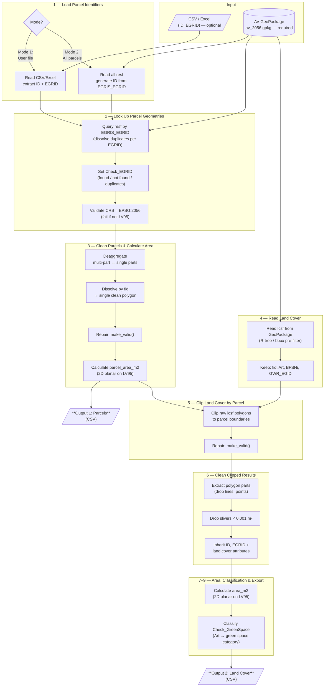

# Landcover Survey — Technical Specification

## Goal

Calculate **how much area (m²) of each land cover type** exists within each cadastral parcel, using official Swiss survey data.

The tool clips every land cover polygon that intersects a parcel to the parcel boundary, then computes the 2D area of each clipped piece on the LV95 projection (EPSG:2056). The result is a per-parcel breakdown of land cover usage in square meters.

### Outputs

Two CSV output tables (no geometry exported). Both are exported by default and can be individually disabled:

1. **Parcels** (`--no-parcels` to disable) — One row per parcel with identifiers, official area, calculated area, and optional aggregation columns (SIA 416, sealed area, green space, per-type breakdown). In Mode 1, user-provided columns and error messages for unresolved EGRIDs are included.

2. **Land Cover** (`--no-landcover` to disable) — One row per clipped land cover piece per parcel, with the land cover type, clipped area, and green space classification.

---

## Modes of Operation

### Mode 1: User-Provided Parcel List
The user provides a CSV or Excel file containing at minimum:
- `ID` — user-defined feature identifier
- `EGRID` — E-GRID foreign key used to look up the official parcel geometry in the AV data

Additional user columns are preserved and carried through to the Parcels output. If an EGRID is not found in the survey data, the row appears in the Parcels output with an error message (`Check_EGRID`).

### Mode 2: Full Survey Processing
All parcels from the official survey GeoPackage (`resf` table) are processed. No user input file is needed.

---

## Geometry Cleanup

Survey polygons can have self-intersections, multi-part geometries, or slivers. To get correct areas, parcel geometries go through a three-step cleanup before clipping:

1. **Deaggregate** — split multi-part geometries into single parts
2. **Dissolve** — merge parts back into one polygon per `fid` (survey feature ID)
3. **Repair** — fix invalid geometries via `shapely.make_valid()` (not `buffer(0)`, which can collapse narrow polygons)

Land cover geometries are **not** cleaned before clipping (matching the original FME workflow). Instead, clipped results are repaired and filtered afterwards — non-polygon artifacts and slivers < 0.001 m² are dropped.

### Official vs. Calculated Area

The official area (`Flaechenmass`) is the *legal* area and may differ from the computed polygon area due to projection reductions or rounding per legal requirements (VAV Art. 16). Small discrepancies (sub-m² for small parcels, several m² for large ones) are normal. The calculated `parcel_area_m2` is useful for QA comparison and as a fallback when `Flaechenmass` is missing.

### Duplicate EGRIDs

A single EGRID can map to multiple `fid` entries in `resf` — e.g. during ongoing mutations, or when building rights (SDR) overlap properties. When this happens, all matching geometries are dissolved into one polygon per EGRID. This is flagged in `Check_EGRID`.

---

## Data Model

### Input: User Parcel List (Mode 1)

| Attribute | Format | Required | Alias EN | Alias DE | Description EN | Description DE |
|-----------|--------|----------|----------|----------|----------------|----------------|
| `ID` | `varchar` | Yes | ID | ID | User-defined feature identifier | Benutzerdefinierte Objektkennung |
| `EGRID` | `varchar(14)` | Yes | E-GRID | E-GRID | Federal parcel identifier (foreign key to AV) | Eidgenössischer Grundstücksidentifikator (Fremdschlüssel zu AV) |
| *(other columns)* | *(varies)* | No | — | — | Passed through unchanged to the Parcels output | Werden unverändert in die Parzellen-Ausgabe übernommen |

### Input: Official Survey GeoPackage (AV)

**Source**: `av_2056.gpkg` — CH1903+ / LV95 (EPSG:2056)
Available at: https://www.geodienste.ch/services/av

#### Table: `resf` — Parcels (Grundstücke: Liegenschaften und SDR)

The `resf` table contains both Liegenschaften (real property) and selbständige und dauernde Rechte (SDR / independent permanent rights, e.g. Baurecht). Both types carry an EGRID and are processed uniformly.

| Attribute | Format | Required | Alias EN | Alias DE | Description EN | Description DE |
|-----------|--------|----------|----------|----------|----------------|----------------|
| `fid` | `integer` | Always | Feature ID | Feature-ID | Internal GeoPackage feature ID | Interne GeoPackage Feature-ID |
| `EGRIS_EGRID` | `varchar(14)` | Always | E-GRID | E-GRID | Federal parcel identifier | Eidgenössischer Grundstücksidentifikator |
| `Nummer` | `varchar` | Always | Parcel Number | Grundstücknummer | Official parcel number | Offizielle Grundstücknummer |
| `NBIdent` | `varchar` | Always | NB Ident | NB-Ident | Surveying office identifier | Nachführungsstellenidentifikator |
| `BFSNr` | `integer` | Always | BFS Number | BFS-Nummer | Federal municipality number | Gemeindenummer des BFS |
| `Flaechenmass` | `integer` | Optional | Official Area (m²) | Fläche amtlich (m²) | Legal area in square meters (may be missing; may differ from calculated area — see note above) | Amtliche Fläche in Quadratmetern (kann fehlen; kann von berechneter Fläche abweichen — siehe Hinweis oben) |
| `area_m2` | `float` | Always | **Derived:** Calculated Area (m²) | **Abgeleitet:** Berechnete Fläche (m²) | 2D planar area on LV95 after deaggregate + dissolve + repair | 2D-Planfläche auf LV95 nach Deaggregation + Dissolve + Reparatur |
| `GWR_EGID` | `integer` | Optional | GWR Building ID | GWR-Gebäude-ID | Federal building register ID | Eidg. Gebäudeidentifikator |
| `geom` | `MULTIPOLYGON` | Always | Geometry | Geometrie | Parcel polygon geometry (used internally, not exported) | Grundstück-Polygongeometrie (intern verwendet, nicht exportiert) |

#### Table: `lcsf` — Land Cover Surfaces (Bodenabdeckung)

| Attribute | Format | Required | Alias EN | Alias DE | Description EN | Description DE |
|-----------|--------|----------|----------|----------|----------------|----------------|
| `fid` | `integer` | Always | Feature ID | Feature-ID | Internal GeoPackage feature ID | Interne GeoPackage Feature-ID |
| `Art` | `varchar` | Always | Land Cover Type | Bodenabdeckungsart | Type of land cover (BBArt domain) | Art der Bodenabdeckung (BBArt-Domäne) |
| `BFSNr` | `integer` | Always | BFS Number | BFS-Nummer | Federal municipality number | Gemeindenummer des BFS |
| `area_m2` | `float` | Always | **Derived:** Calculated Area (m²) | **Abgeleitet:** Berechnete Fläche (m²) | 2D planar area on LV95 after deaggregate + dissolve + repair | 2D-Planfläche auf LV95 nach Deaggregation + Dissolve + Reparatur |
| `GWR_EGID` | `integer` | Optional | GWR Building ID | GWR-Gebäude-ID | Federal building register ID | Eidg. Gebäudeidentifikator |
| `geom` | `MULTIPOLYGON` | Always | Geometry | Geometrie | Land cover polygon geometry (used internally, not exported) | Bodenabdeckung-Polygongeometrie (intern verwendet, nicht exportiert) |

---

## Land Cover Classification (BBArt)

The 26 land cover types are defined in the Swiss data model **DM.01-AV-CH** as the `BBArt` domain. This is a Swiss national classification (not INSPIRE or CORINE) defined in the technical ordinance on official surveying (TVAV, SR 211.432.21, Art. 14–19). The data model will be replaced by **DMAV** by 2027-12-31.

### Complete Land Cover Type Hierarchy

| AVS Code | Main Category | Sub-category | `Art` Value | EN | DE | SIA 416 | Sealed | Green Space |
|----------|---------------|--------------|-------------|-----|-----|---------|--------|-------------|
| 0 | Buildings | — | `Gebaeude` | Buildings | Gebäude | GGF | Yes | — |
| 1 | Sealed | — | `Strasse_Weg` | Road, path | Strasse, Weg | BUF | Yes | — |
| 2 | Sealed | — | `Trottoir` | Sidewalk | Trottoir | BUF | Yes | — |
| 3 | Sealed | — | `Verkehrsinsel` | Traffic island | Verkehrsinsel | BUF | Yes | — |
| 4 | Sealed | — | `Bahn` | Railway | Bahn | BUF | Yes | — |
| 5 | Sealed | — | `Flugplatz` | Airfield | Flugplatz | BUF | Yes | — |
| 6 | Sealed | — | `Wasserbecken` | Water basin | Wasserbecken | BUF | Yes | — |
| 7 | Sealed | — | `uebrige_befestigte` | Other sealed surfaces | Übrige befestigte | BUF | Yes | — |
| 8 | Soil-covered | — | `Acker_Wiese_Weide` | Arable land, meadow, pasture | Acker, Wiese, Weide | BUF | No | Soil-covered |
| 9 | Soil-covered | Intensive | `Reben` | Vineyards | Reben | BUF | No | Soil-covered |
| 10 | Soil-covered | Intensive | `uebrige_Intensivkultur` | Other intensive cultivation | Übrige Intensivkultur | BUF | No | — * |
| 11 | Soil-covered | — | `Gartenanlage` | Garden area | Gartenanlage | BUF | No | Soil-covered |
| 12 | Soil-covered | — | `Hoch_Flachmoor` | Raised/flat bog | Hoch-/Flachmoor | BUF | No | Soil-covered |
| 13 | Soil-covered | — | `uebrige_humusierte` | Other soil-covered | Übrige humusierte | BUF | No | Soil-covered |
| 14 | Water | — | `stehendes` | Standing water | Stehendes Gewässer | UUF | No | — |
| 15 | Water | — | `fliessendes` | Flowing water | Fliessendes Gewässer | UUF | No | — |
| 16 | Water | — | `Schilfguertel` | Reed belt | Schilfgürtel | UUF | No | — |
| 17 | Wooded | — | `geschlossener_Wald` | Closed forest | Geschlossener Wald | UUF | No | Wooded |
| 18 | Wooded | Wytweide | `Wytweide_dicht` | Dense wooded pasture | Wytweide dicht | UUF | No | Soil-covered ** |
| 19 | Wooded | Wytweide | `Wytweide_offen` | Open wooded pasture | Wytweide offen | UUF | No | Soil-covered ** |
| 20 | Wooded | — | `uebrige_bestockte` | Other wooded | Übrige bestockte | UUF | No | Wooded |
| 21 | Unvegetated | — | `Fels` | Rock | Fels | UUF | No | — |
| 22 | Unvegetated | — | `Gletscher_Firn` | Glacier, firn | Gletscher, Firn | UUF | No | — |
| 23 | Unvegetated | — | `Geroell_Sand` | Scree, sand | Geröll, Sand | UUF | No | — |
| 24 | Unvegetated | — | `Abbau_Deponie` | Extraction, landfill | Abbau, Deponie | UUF | No | — |
| 25 | Unvegetated | — | `uebrige_vegetationslose` | Other unvegetated | Übrige vegetationslose | UUF | No | — |

> **SIA 416 Legend:** **GSF** = Grundstücksfläche / total parcel area = GGF + UF. **GGF** = Gebäudegrundfläche / building footprint. **UF** = Umgebungsfläche / surrounding area = BUF + UUF. **BUF** = Bearbeitete Umgebungsfläche / developed surrounding (sealed + soil-covered). **UUF** = Unbearbeitete Umgebungsfläche / undeveloped surrounding (water + wooded + unvegetated).
> **Sealed area** = GGF + all sealed types (all types with Sealed = Yes).
>
> **Green Space Legend:** **Soil-covered** = green space (humusiert), **Wooded** = green space (bestockt), **—** = not green space.
> \* `uebrige_Intensivkultur` is officially "soil-covered" (humusiert) but classified as not green space — typically managed/sealed horticultural surfaces (orchards, nurseries).
> \*\* `Wytweide_dicht` and `Wytweide_offen` are officially "bestockt" but treated as Humusiert — primarily open pasture with partial tree cover.

### INTERLIS Hierarchy (DM.01-AV-CH)

```
BBArt = (
  Gebaeude,
  befestigt (
    Strasse_Weg, Trottoir, Verkehrsinsel, Bahn,
    Flugplatz, Wasserbecken, uebrige_befestigte),
  humusiert (
    Acker_Wiese_Weide,
    Intensivkultur (Reben, uebrige_Intensivkultur),
    Gartenanlage, Hoch_Flachmoor, uebrige_humusierte),
  Gewaesser (
    stehendes, fliessendes, Schilfguertel),
  bestockt (
    geschlossener_Wald,
    Wytweide (Wytweide_dicht, Wytweide_offen),
    uebrige_bestockte),
  vegetationslos (
    Fels, Gletscher_Firn, Geroell_Sand,
    Abbau_Deponie, uebrige_vegetationslose));
```

### Green Space Classification (Project-Specific)

Each land cover type is also classified as green space or not. Two special cases:

- **Wytweide** (`Wytweide_dicht`, `Wytweide_offen`) — officially "wooded" (bestockt), but treated as soil-covered green space because pasture dominates over tree cover.
- **`uebrige_Intensivkultur`** — officially "soil-covered" (humusiert), but classified as not green space because these are typically managed horticultural surfaces (orchards, nurseries).

| Green Space Category | DE | `Art` Values |
|---------------------|-----|-------------|
| Green space (soil-covered) | Grünfläche (Humusiert) | `Acker_Wiese_Weide`, `Gartenanlage`, `Reben`, `Hoch_Flachmoor`, `uebrige_humusierte`, `Wytweide_dicht`, `Wytweide_offen` |
| Green space (wooded) | Grünfläche (Bestockt) | `geschlossener_Wald`, `uebrige_bestockte` |
| Not green space | Keine Grünfläche | All others |

---

## Output Tables (Alphanumeric — No Geometry)

### Parcels (`{input}_parcels_{timestamp}.csv`)

One row per parcel. In Mode 1, includes user-provided columns and an error message for unresolved EGRIDs. Exported by default; disable with `--no-parcels`.

| Attribute | Format | Required | Alias EN | Alias DE | Description EN | Description DE |
|-----------|--------|----------|----------|----------|----------------|----------------|
| `ID` | `varchar` | Always | ID | ID | User-defined identifier (Mode 1) or generated from AV (Mode 2) | Benutzerdefinierte Kennung (Modus 1) oder aus AV generiert (Modus 2) |
| `EGRID` | `varchar(14)` | Always | E-GRID | E-GRID | Federal parcel identifier | Eidgenössischer Grundstücksidentifikator |
| `Nummer` | `varchar` | Always | Parcel Number | Grundstücknummer | Official parcel number from AV | Offizielle Grundstücknummer aus AV |
| `BFSNr` | `integer` | Always | BFS Number | BFS-Nummer | Federal municipality number | Gemeindenummer des BFS |
| `Check_EGRID` | `varchar` | Always | EGRID Status | EGRID-Status | "EGRID found in AV" if found, error message if not | "EGRID found in AV" falls gefunden, Fehlermeldung falls nicht |
| `Flaeche` | `integer` | Always | Official Area (m²) | Fläche amtlich (m²) | Legal area from AV (may be missing) | Amtliche Fläche aus AV (kann fehlen) |
| `parcel_area_m2` | `float` | Always | Parcel Area (m²) | Grundstückfläche (m²) | Calculated 2D planar area of the cleaned parcel polygon | Berechnete 2D-Planfläche des bereinigten Grundstück-Polygons |
| `GGF_m2` | `float` | Optional | Building Footprint (m²) | Gebäudegrundfläche (m²) | Aggregated building footprint area (SIA 416 GGF) | Aggregierte Gebäudegrundfläche (SIA 416 GGF) |
| `BUF_m2` | `float` | Optional | Developed Surrounding (m²) | Bearbeitete Umgebungsfläche (m²) | Aggregated developed surrounding area (SIA 416 BUF: sealed + soil-covered) | Aggregierte bearbeitete Umgebungsfläche (SIA 416 BUF: befestigt + humusiert) |
| `UUF_m2` | `float` | Optional | Undeveloped Surrounding (m²) | Unbearbeitete Umgebungsfläche (m²) | Aggregated undeveloped surrounding area (SIA 416 UUF: water + wooded + unvegetated) | Aggregierte unbearbeitete Umgebungsfläche (SIA 416 UUF: Gewässer + bestockt + vegetationslos) |
| `Sealed_m2` | `float` | Optional | Sealed Area (m²) | Versiegelte Fläche (m²) | GGF + sealed surfaces (buildings + all befestigt) | GGF + befestigte Flächen (Gebäude + alle befestigt) |
| `GreenSpace_m2` | `float` | Optional | Green Space (m²) | Grünfläche (m²) | Total green space area (soil-covered + wooded types from green space classification) | Gesamte Grünfläche (humusiert + bestockt gemäss Grünfläche-Klassifizierung) |
| `{Art}_m2` | `float` | Optional | Per-Type Area (m²) | Fläche pro Typ (m²) | One column per land cover type present (e.g. `Gebaeude_m2`, `Strasse_Weg_m2`) | Eine Spalte pro vorhandener Bodenabdeckungsart |
| *(user columns)* | *(varies)* | Optional | — | — | Additional columns from user input (Mode 1 only) | Zusätzliche Spalten aus Benutzereingabe (nur Modus 1) |

> **Note:** All aggregation columns are included by default. Use `--no-aggregate` to omit them. The sum of `GGF_m2 + BUF_m2 + UUF_m2` should approximate `parcel_area_m2` (small differences are expected due to topology gaps in the source data).

### Land Cover (`{input}_landcover_{timestamp}.csv`)

One row per clipped land cover feature per parcel. Exported by default; disable with `--no-landcover`.

| Attribute | Format | Required | Alias EN | Alias DE | Description EN | Description DE |
|-----------|--------|----------|----------|----------|----------------|----------------|
| `ID` | `varchar` | Always | ID | ID | Parcel identifier (same as in Parcels output) | Grundstückskennung (gleich wie in Parzellen-Ausgabe) |
| `EGRID` | `varchar(14)` | Always | E-GRID | E-GRID | Parcel identifier (links to Parcels output) | Grundstücksidentifikator (Verknüpfung zu Parzellen-Ausgabe) |
| `fid` | `integer` | Always | LC Feature ID | BA Feature-ID | Land cover feature ID from AV | Bodenabdeckung Feature-ID aus AV |
| `Art` | `varchar` | Always | Land Cover Type | Bodenabdeckungsart | Type of land cover | Art der Bodenabdeckung |
| `BFSNr` | `integer` | Always | BFS Number | BFS-Nummer | Federal municipality number | Gemeindenummer des BFS |
| `GWR_EGID` | `integer` | Always | GWR Building ID | GWR-Gebäude-ID | Federal building register ID (may be empty) | Eidg. Gebäudeidentifikator (kann leer sein) |
| `Check_GreenSpace` | `varchar` | Always | Green Space Check | Grünfläche-Prüfung | Green space classification based on `Art`: "Green space (soil-covered)", "Green space (wooded)", or "Not green space" | Grünfläche-Klassifizierung basierend auf `Art` |
| `area_m2` | `float` | Always | LC Area (m²) | BA-Fläche (m²) | Calculated 2D planar area of clipped land cover polygon | Berechnete 2D-Planfläche des geschnittenen Bodenabdeckung-Polygons |

---

## Processing Steps



### 1. Load Parcel Identifiers
- **Mode 1**: Read user CSV/Excel → extract `ID` and `EGRID` columns (plus any extra user columns)
- **Mode 2**: Read all features from `resf` table → use `EGRIS_EGRID` as `EGRID`, generate `ID`

### 2. Look Up Parcel Geometries
- Query `resf` table in the GeoPackage by `EGRIS_EGRID`
- Handle duplicate EGRIDs: dissolve all matching geometries into a single polygon per EGRID
- Extract parcel polygon geometries
- Set `Check_EGRID`:
  - `"EGRID found in AV"` — single match found
  - `"EGRID found in AV (n entries merged)"` — multiple `fid` entries dissolved
  - `"EGRID missing or not in AV"` — not found (Mode 1: row kept with error)
- Validate CRS is EPSG:2056 (CH1903+ / LV95) — fail with a clear error if not

### 3. Clean Parcel Geometries & Calculate Area
- Deaggregate multi-part geometries
- Dissolve/merge parts back by `fid` into single clean polygons
- Repair invalid geometries using `make_valid()`
- Calculate 2D planar polygon area on LV95 (`parcel_area_m2`)
- **Write Output 1: Parcels**

### 4. Read Land Cover Surfaces
- Read `lcsf` table from GeoPackage
- R-tree spatial index or bounding-box pre-filter for performance (optimization only — the actual spatial test is the clip in step 5)
- Keep attributes: `fid`, `Art`, `BFSNr`, `GWR_EGID`

### 5. Clip Land Cover by Parcel
- Clip raw land cover polygons to parcel boundaries using vectorised `shapely.intersection()`
- Repair clipped geometries using `make_valid()`
- Note: LC geometries are **not** cleaned before clipping (matching the FME workflow). Cleanup happens on the clipped results in step 6.

### 6. Clean Clipped Results
- Extract only Polygon/MultiPolygon parts from clip results (shared boundaries can produce LineStrings, Points, or GeometryCollections)
- Drop slivers below 0.001 m² that arise from shared boundary clipping
- Each clip result inherits the parcel's `ID`, `EGRID` and the land cover attributes

### 7. Calculate Clipped Land Cover Area
- Calculate 2D planar area on LV95 of each clipped land cover polygon (`area_m2`)

### 8. Classify Green Space
- Create `Check_GreenSpace` based on `Art` value (see classification table above)

### 9. Export Land Cover
- **Write Output 2: Land Cover**

---

## Implementation

### Dependencies
- `geopandas` — GeoPackage reading, spatial operations (clip, dissolve, area)
- `pandas` — tabular data, CSV/Excel I/O
- `shapely` (>= 2.0) — geometry operations (`make_valid()`, intersection)
- `openpyxl` — Excel (.xlsx) input reading

### Performance
- **Mode 2** processes ~3.5M Swiss parcels. Loading all land cover into memory at once is not feasible.
- Municipality-level batching (by `BFSNr`) keeps memory bounded: load parcels for one municipality, use the bounding box to pre-filter land cover, process, append results.
- R-tree spatial index on the GeoPackage significantly speeds up land cover lookups.

### Key Operations
1. Read user input (CSV/Excel) or enumerate all parcels from `resf`
2. Query GeoPackage `resf` table by EGRID, dissolve duplicate EGRIDs, extract parcel geometries
3. Validate CRS is EPSG:2056
4. Deaggregate + dissolve + `make_valid()` parcel geometries by `fid`
5. Calculate parcel 2D planar area
6. Export Parcels output
7. Read `lcsf` layer (R-tree / bbox pre-filter), keep selected attributes
8. Clip raw land cover by parcel boundaries, `make_valid()` clipped results
9. Extract polygon parts, drop non-polygon results and slivers < 0.001 m²
10. Calculate clipped land cover 2D planar area
11. Classify green space
12. Export Land Cover output

---

## Architecture

### Project Structure

```
landcover-survey/
├── assets/                       # Images for README
├── data/                         # Input CSVs and output results
│   └── test_data.csv              # Sample input (Mode 1)
├── docs/
│   └── SPECIFICATION.md
├── fme/                          # Original FME workflow (reference only)
│   └── Landcover Survey FME.fmw
├── python/                       # Python scripts (flat, no package)
│   ├── cli.py                    # Entry point: python cli.py (argparse)
│   ├── config.py                 # Constants, BBArt domain, green space mapping, defaults
│   ├── geometry.py               # Geometry cleanup pipeline
│   ├── data_io.py                # Read/write CSV, Excel, GeoPackage layers
│   └── pipeline.py               # Main processing orchestration
├── pyproject.toml                # Project metadata, dependencies
└── LICENSE
```

### Module Responsibilities

#### `cli.py` — Command-Line Interface
Parses arguments and calls the pipeline. Minimal logic — delegates immediately.

```
Arguments:
  --mode {1,2}            Processing mode (default: 1)
  --input PATH            Path to user CSV/Excel (required for Mode 1)
  --gpkg PATH             Path to AV GeoPackage (default: D:\AV_lv95\av_2056.gpkg)
  --output-dir PATH       Output directory (default: ./data)
  --limit N               Limit parcels (Mode 1: first N rows, Mode 2: first N municipalities)
  --chunk-size N          Mode 1: rows per processing chunk (default: 10000)
  --no-aggregate          Disable land cover area aggregation on parcels output
  --no-parcels            Skip exporting the parcels CSV
  --no-landcover          Skip exporting the land cover CSV
  --verbose, -v           Enable DEBUG logging
```

Logging goes to both console and `<output-dir>/landcover_survey.log`.

#### `config.py` — Constants and Classification
- `GREEN_SPACE: dict[str, str]` — maps each `Art` value to its green space category
- `SIA416: dict[str, str]` — maps each `Art` value to SIA 416 category (GGF / BUF / UUF)
- `DEFAULT_GPKG_PATH`, `SLIVER_THRESHOLD` (0.001 m²), `CRS_EPSG` (2056), `COL_FLAECHE`
- No runtime state — pure constants

#### `geometry.py` — Geometry Cleanup
Reusable functions for geometry cleanup and clip result filtering.

```python
def clean_geometries(gdf: GeoDataFrame, group_col: str) -> GeoDataFrame:
    """Deaggregate multi-part → dissolve by group_col → make_valid().

    Returns a GeoDataFrame with one clean polygon per unique group_col value.
    """

def filter_clip_results(gdf: GeoDataFrame, threshold: float = 0.001) -> GeoDataFrame:
    """Drop non-polygon geometries and slivers below threshold (m²).

    After clipping, shared boundaries can produce LineStrings, Points,
    or GeometryCollections. Extract only Polygon/MultiPolygon parts,
    then drop features with area < threshold.
    """
```

#### `data_io.py` — Input/Output
Handles all file reading and writing. Isolates file format dependencies.

```python
def read_user_input(path: str) -> DataFrame:
    """Read CSV or Excel. Validate ID and EGRID columns exist."""

def read_parcels(gpkg_path: str, egrids: list[str] | None = None) -> GeoDataFrame:
    """Read resf layer. If egrids provided, filter by EGRIS_EGRID (SQL WHERE).
    For Mode 2, reads all features (optionally batched by BFSNr)."""

def read_landcover(gpkg_path: str, bbox: tuple | None = None) -> GeoDataFrame:
    """Read lcsf layer with optional bounding box pre-filter."""

def write_csv(df: DataFrame, path: str) -> None:
    """Write DataFrame to CSV."""
```

#### `pipeline.py` — Main Processing Orchestration
Coordinates the full workflow. Two entry points, one shared core.

```python
def run(mode: int, input_path: str | None, gpkg_path: str, output_dir: str) -> None:
    """Main entry point. Dispatches to Mode 1 or Mode 2, then runs shared pipeline."""

def _load_parcel_identifiers(mode, input_path, gpkg_path) -> DataFrame:
    """Step 1: Load EGRID list from user file or enumerate all from resf."""

def _lookup_parcel_geometries(egrids_df, gpkg_path) -> GeoDataFrame:
    """Step 2: Query resf by EGRID, dissolve duplicates, set Check_EGRID."""

def _process_parcels(parcels_gdf) -> GeoDataFrame:
    """Steps 3: Clean parcel geometries, calculate parcel_area_m2."""

def _process_landcover(parcels_gdf, gpkg_path) -> DataFrame:
    """Steps 4–8: Batch-read LC via R-tree, clip per parcel, calc area, classify."""

def _clip_single_parcel(lcsf, parcel) -> DataFrame:
    """Clip LC features against one parcel using vectorised shapely.intersection."""
```

### Key Design Decisions

**SQL-level filtering** — Read from GeoPackage using SQL `WHERE` clauses, not full table loads. Critical for Mode 1 where only a few EGRIDs are needed from a ~3.5M row table.

**BFSNr batching (Mode 2)** — Process one municipality at a time: load parcels, compute bounding box, pre-filter land cover, process, append. Keeps memory bounded regardless of dataset size.

**Left join (Mode 1)** — Unfound EGRIDs produce output rows with a `Check_EGRID` error message and null area. User columns are always preserved. Mirrors the FME FeatureJoiner left-join behavior.

**No geometry in outputs** — Both outputs are plain DataFrames. Geometry is used internally for clipping and area calculation, then dropped before CSV export.

### Important Considerations

1. **GeoPackage reading with `where` clause** — `geopandas.read_file()` accepts `where="EGRIS_EGRID IN ('CH...', 'CH...')"` for efficient SQL-level filtering. For large EGRID lists, batch the SQL IN clause (e.g. 500 EGRIDs per query).

2. **Parcel cleanup before clip, LC cleanup after** — Parcel geometries are deaggregated + dissolved + repaired before clipping (step 3). Land cover geometries are clipped raw, then repaired and filtered after clipping (steps 5–6). This matches the FME workflow and avoids the cost of cleaning millions of LC features upfront.

3. **GeometryCollection handling** — `shapely.intersection()` can return mixed GeometryCollections (polygons + linestrings from shared edges). Extract only Polygon/MultiPolygon parts using `shapely.get_parts()` with `extract_type=3` (Polygon).

4. **Area calculation** — Since the CRS is LV95 (EPSG:2056), a 2D planar Swiss projection, `geometry.area` in GeoPandas gives correct square meters directly. No reprojection needed.

5. **Thread safety** — GeoPackage (SQLite-backed) supports concurrent reads. If future parallelization is considered, multiple readers per file are safe; writes must be serialized.

6. **Error propagation** — Geometry cleanup failures (e.g. `make_valid()` returning an empty geometry) should be logged but not halt the pipeline. The affected feature gets `area_m2 = 0` and a note in the output.

7. **Logging** — Use Python `logging` module with configurable verbosity. Progress reporting is important for Mode 2 (thousands of municipalities).

---

## Limitations

### Data Coverage
- **GeoPackage completeness** — The AV GeoPackage may not contain all Swiss municipalities (cantons deliver data independently, some may be missing or outdated). Missing municipalities produce no output rows, not errors.
- **DMAV transition** — The current data model DM.01-AV-CH is being replaced by DMAV (deadline: 2027-12-31). The BBArt domain values and `resf`/`lcsf` table schemas may change. The tool will need updating when DMAV is adopted.
- **SDR without geometry** — Some selbständige und dauernde Rechte (SDR) entries in `resf` may have an EGRID but no polygon geometry (e.g. Quellenrecht, Durchleitungsrecht). These are treated as "not found" in the current implementation.

### Geometry & Area Accuracy
- **Calculated vs. legal area** — `parcel_area_m2` is the computed 2D planar area and will not match `Flaechenmass` exactly (see Data Quality Note). The tool does not replace the official area — it provides an independent calculation for QA and analysis.
- **Projection limitations** — Area calculation assumes the LV95 planar projection (EPSG:2056) is sufficiently accurate. For very large parcels at high altitudes, terrain-induced projection distortion may introduce sub-per-mille errors. This is negligible for practical purposes.
- **Sliver threshold** — Clip results smaller than 0.001 m² are silently dropped. This threshold is appropriate for cadastral-scale data but may discard legitimate micro-features in edge cases.
- **Topology gaps** — The AV data is not guaranteed to be topologically clean. Small gaps or overlaps between adjacent land cover polygons can cause the sum of clipped land cover areas to not exactly match the parcel area.

### Performance
- **Mode 2 runtime** — Processing all ~3.5M Swiss parcels is I/O and compute-intensive. With BFSNr batching, expect hours of runtime on a standard workstation. No parallelization is implemented.
- **Memory** — Mode 1 with a small input list uses minimal memory. Mode 2 processes one municipality at a time to stay bounded, but municipalities with very many parcels (e.g. Zürich) may still require several GB of RAM.
- **GeoPackage file size** — The national AV GeoPackage is ~15–20 GB. The tool reads from it via SQL queries without loading it entirely, but the file must be on a local or fast-access drive.

---

## Error Handling & Logging

### Error Strategy

The pipeline follows a **fail-soft** approach: individual feature errors are logged and flagged in the output, but do not halt processing. Only systemic errors (wrong CRS, missing input file, missing required columns) cause an immediate abort.

| Situation | Behaviour | Output |
|-----------|-----------|--------|
| EGRID not found in AV | Row kept in parcels output | `Check_EGRID` = `"EGRID missing or not in AV"`, `parcel_area_m2` = null |
| Duplicate EGRIDs (multiple fid per EGRID) | Geometries dissolved into one | `Check_EGRID` = `"EGRID found in AV (n entries merged)"` |
| `make_valid()` returns empty geometry | Feature kept with zero area | `parcel_area_m2` or `area_m2` = 0, logged as WARNING |
| Clip produces only lines/points (no polygon) | Feature dropped | Logged as DEBUG |
| Clip produces sliver < 0.001 m² | Feature dropped | Logged as DEBUG |
| Unknown `Art` value (not in BBArt domain) | Feature kept | `Check_GreenSpace` = `"Not green space"`, logged as WARNING |
| CRS is not EPSG:2056 | **Pipeline aborts** | `ValueError` with clear message |
| Input file missing `ID` or `EGRID` column | **Pipeline aborts** | `ValueError` with clear message |
| GeoPackage file not found or unreadable | **Pipeline aborts** | `FileNotFoundError` or driver error |
| Mode 1 without `--input` | **CLI aborts** | argparse error message |

### Logging Levels

| Level | Content |
|-------|---------|
| `ERROR` | Unrecoverable failures (wrong CRS, missing file, missing columns) |
| `WARNING` | Data quality issues that affect results (empty geometries after repair, unknown Art values, parcels with zero area) |
| `INFO` | Progress milestones (rows read, municipalities processed, output files written) |
| `DEBUG` | Per-feature details (dropped slivers, dropped non-polygon clips, SQL queries) |

Default level is `INFO`. Use `--verbose` / `-v` for `DEBUG`.

### Log Format

```
HH:MM:SS LEVEL    module — message
```

Examples:
```
14:23:01 INFO     io — Read 42 parcels from resf
14:23:02 WARNING  pipeline — EGRID CH000000000000 returned empty geometry after make_valid()
14:23:03 INFO     pipeline — Processing BFSNr 261 (1/2148)
14:23:05 DEBUG    geometry — Dropped 3 slivers < 0.001 m² after clip
14:23:06 INFO     io — Wrote 156 rows to landcover.xlsx
```

---

## Legal Framework & References

### Data Model
- [DM.01-AV-CH](https://www.cadastre-manual.admin.ch/de/datenmodell-der-amtlichen-vermessung-dm01-av-ch) — Current INTERLIS data model for the official cadastral survey (replaced by DMAV by 2027-12-31)
- [INTERLIS](https://www.interlis.ch/en) (SN 612030) — Swiss standard for geodata description and transfer

### Geoinformation Law
- [Bundesverfassung (SR 101)](https://www.fedlex.admin.ch/eli/cc/1999/404/de) — Art. 75a Vermessung
- [Geoinformationsgesetz, GeoIG (SR 510.62)](https://www.fedlex.admin.ch/eli/cc/2008/388/de) — Federal Act on Geoinformation
- [Geoinformationsverordnung, GeoIV (SR 510.620)](https://www.fedlex.admin.ch/eli/cc/2008/389/de) — Geoinformation Ordinance
- [GeoIV-swisstopo (SR 510.620.1)](https://www.fedlex.admin.ch/eli/cc/2008/390/de) — swisstopo Ordinance on Geoinformation

### Official Cadastral Survey (Amtliche Vermessung)
- [VAV (SR 211.432.2)](https://www.fedlex.admin.ch/eli/cc/1992/2446_2446_2446/de) — Ordinance on the Official Cadastral Survey
- [TVAV / VAV-VBS (SR 211.432.21)](https://www.fedlex.admin.ch/eli/cc/2023/530/de) — Technical Ordinance on the Official Cadastral Survey (Art. 14–19: land cover categories)
- [GeomV (SR 211.432.261)](https://www.fedlex.admin.ch/eli/cc/2008/387/de) — Ordinance on Engineer-Surveyors

### ÖREB-Kataster
- [ÖREBKV (SR 510.622.4)](https://www.fedlex.admin.ch/eli/cc/2009/553/de) — Ordinance on the Cadastre of Public-Law Restrictions on Landownership

### Land Register (Grundbuch)
- [GBV (SR 211.432.1)](https://www.fedlex.admin.ch/eli/cc/2011/667/de) — Land Register Ordinance
- [TGBV (SR 211.432.11)](https://www.fedlex.admin.ch/eli/cc/2013/3/de) — Technical Ordinance on the Land Register

### Online Resources
- [Cadastre Manual](https://www.cadastre-manual.admin.ch/) — Handbuch der Amtlichen Vermessung
- [Legal Framework](https://www.cadastre.ch/de/rechtliche-grundlagen) — Rechtliche Grundlagen
- [Survey Data Download](https://www.geodienste.ch/services/av) — AV GeoPackage download

---

## Terminology

| Term | EN | DE | Description |
|------|----|----|-------------|
| AV | Official Cadastral Survey | Amtliche Vermessung | Official cadastral survey of Switzerland |
| BBArt | Land Cover Type | Bodenabdeckungsart | Land cover type domain (26 values) in the DM.01-AV-CH data model |
| BFSNr | BFS Municipality Number | BFS-Nummer | Federal municipality number assigned by the Swiss Federal Statistical Office |
| BUF | Developed Surrounding Area | Bearbeitete Umgebungsfläche | Sealed + soil-covered surfaces around buildings — SIA 416 |
| CRS | Coordinate Reference System | Koordinatenreferenzsystem | This project uses EPSG:2056 (LV95) |
| DMAV | AV Data Model (new) | Datenmodell der AV | New data model replacing DM.01-AV-CH (deadline: 2027-12-31) |
| DM.01-AV-CH | AV Data Model (current) | Datenmodell der AV | Current INTERLIS data model for the official cadastral survey |
| EGRID | Federal Parcel Identifier | E-GRID | 14-character string (e.g. `CH427760110057`) uniquely identifying a parcel |
| EGRIS | Land Register Information System | EGRIS | Swiss land register information system (source of EGRID identifiers) |
| Flaechenmass | Official Area | Flächenmass | Official legal area of a parcel in m² (may differ from calculated area) |
| GeoPackage | GeoPackage | — | SQLite-based format for geospatial data (OGC standard, `.gpkg` extension) |
| GGF | Building Footprint Area | Gebäudegrundfläche | Building footprint area — SIA 416 |
| GWR_EGID | Federal Building ID | GWR-EGID | Federal building register ID from the GWR (Gebäude- und Wohnungsregister) |
| INTERLIS | INTERLIS | — | Swiss standard for geodata description and transfer (SN 612030) |
| lcsf | Land Cover Surfaces | — | GeoPackage table name for land cover surfaces (Bodenabdeckungsflächen) |
| LV95 | National Survey 1995 | Landesvermessung 1995 | Swiss national survey coordinate system (EPSG:2056, CH1903+) |
| Nummer | Parcel Number | Grundstücknummer | Official parcel number within a municipality |
| resf | Real Estate Surfaces | — | GeoPackage table name for parcels (Liegenschaften and SDR) |
| SDR | Independent Permanent Rights | Selbständige und dauernde Rechte | E.g. building rights (Baurecht) — a type of parcel in the land register |
| SIA 416 | SIA 416 | — | Swiss standard for area calculation: GSF = GGF + UF, UF = BUF + UUF |
| UF | Surrounding Area | Umgebungsfläche | Surrounding area = BUF + UUF — SIA 416 |
| UUF | Undeveloped Surrounding Area | Unbearbeitete Umgebungsfläche | Water + wooded + unvegetated surfaces — SIA 416 |
| VAV | Cadastral Survey Ordinance | Verordnung über die amtliche Vermessung | Ordinance on the official cadastral survey (SR 211.432.2) |
